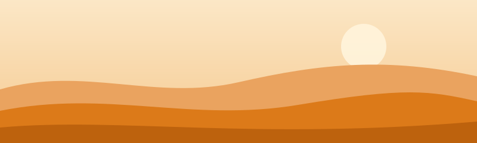

# NotionKit CSS – AI Component Reference

> **Purpose:** An AI-optimised reference for generating correct NotionKit markup. It replaces reading `docs.html` and gives you copy-paste structures, nesting rules, state classes, eight complete app skeletons and the editor and web-component integration contracts.
>
> Generated from the same sources as the documentation (`tools/build-skill.mjs`) – the token tables below are read straight out of `notionkit.css`.

---

## 1. Setup & Boilerplate

### Including the library

```html
<!-- CDN (recommended) -->
<link rel="stylesheet" href="https://cdn.jsdelivr.net/npm/@jungherz-de/notionkit@1/notionkit.min.css">

<!-- Local -->
<link rel="stylesheet" href="notionkit.css">

<!-- Optional: your own theme, loaded after the library -->
<link rel="stylesheet" href="theme-override.css">
```

```bash
npm install @jungherz-de/notionkit
```

### Minimal template

```html
<!DOCTYPE html>
<html lang="en" data-theme="light">
<head>
  <meta charset="UTF-8">
  <meta name="viewport" content="width=device-width, initial-scale=1.0">
  <link rel="stylesheet" href="https://cdn.jsdelivr.net/npm/@jungherz-de/notionkit@1/notionkit.min.css">
</head>
<body class="nk-body">
  <!-- NotionKit markup goes here -->
</body>
</html>
```

### Naming convention

- **Component classes:** `nk-*` (`nk-app`, `nk-tree-item`, `nk-callout`). Every one of them is a future `<nk-*>` custom element with the same stem.
- **Child parts:** short unprefixed classes *inside* a component (`.icon`, `.label`, `.c-icon`, `.m-shortcut`, `.f-label`). They only mean something inside their parent.
- **Modifiers:** plain classes on the component (`.primary`, `.danger`, `.small`, `.blue`, `.info`). No BEM double-dash.
- **State classes:** `.active`, `.open`, `.collapsed`, `.selected`, `.show` plus the attribute `aria-checked="true"`. See §4.
- **Tokens:** `--nk-*` custom properties. Never a hex literal in your own component CSS – derive with `color-mix()`.
- There are **no** unprefixed global rules. `.nk-body` is opt-in and the only thing that touches `<body>`.

### Theming

```html
<html data-theme="light">   <!-- default; the attribute may be omitted -->
<html data-theme="dark">
```

Switch at runtime with `document.documentElement.setAttribute('data-theme', 'dark')`. The token blocks also set `color-scheme`, so native widgets (date pickers, selects, scrollbars) follow.

### The body class

`class="nk-body"` on `<body>` sets the font stack, 14px base size, page background, text colour and antialiasing. Without it NotionKit changes nothing outside its own classes – useful when embedding into an existing page.

---

## 2. Design Tokens

All visual values are custom properties. `:root` holds the light theme, `[data-theme="dark"]` overrides what differs. Values that are not overridden (metrics, fonts, decor colours) inherit.

| Token | Light (`:root`) | Dark (`[data-theme="dark"]`) | Meaning |
|---|---|---|---|
| `--nk-bg` | `#ffffff` | `#191919` | Page background |
| `--nk-bg-sidebar` | `#f9f8f7` | `#202020` | Sidebar and settings nav |
| `--nk-bg-hover` | `rgba(55,53,47,0.06)` | `rgba(255,255,255,0.055)` | Hover wash — a darkening, never a hue change |
| `--nk-bg-active` | `rgba(55,53,47,0.08)` | `rgba(255,255,255,0.08)` | Active/selected row |
| `--nk-bg-callout` | `#f0efed` | `#252525` | Callouts, badges, key caps, segmented track |
| `--nk-bg-code` | `#f7f6f3` | `#202020` | Code block background |
| `--nk-bg-card` | `#ffffff` | `#202020` | Board cards and white buttons — separate from --nk-bg so dark mode can lift them |
| `--nk-bg-input` | `rgba(242,241,238,0.6)` | `rgba(255,255,255,0.055)` | The filled input surface: inputs, selects, textareas, the emoji search |
| `--nk-text` | `#2c2c2b` | `rgba(255,255,255,0.81)` | Body text. Never pure black |
| `--nk-text-secondary` | `#7d7a75` | `rgba(255,255,255,0.46)` | Secondary text, table headers, descriptions |
| `--nk-text-tertiary` | `#91918e` | `rgba(255,255,255,0.32)` | Meta, placeholders, section labels |
| `--nk-text-sidebar` | `#5f5e5b` | `rgba(255,255,255,0.62)` | Tree items, breadcrumbs, topbar buttons — one step darker than secondary, as in Notion |
| `--nk-border` | `rgba(28,19,1,0.11)` | `rgba(255,255,255,0.094)` | Hairline separators, table grid, input borders |
| `--nk-border-strong` | `rgba(27,21,0,0.19)` | `rgba(255,255,255,0.16)` | Input hover, scrollbar thumbs, dashed frames, checkboxes |
| `--nk-accent` | `#2383e2` | `#529CCA` | The one brand colour. Everything accented is mixed from it |
| `--nk-on-accent` | `#ffffff` | — (inherits) | Text and marks on top of the accent or danger fill |
| `--nk-danger` | `#cd3c3a` | `#df5452` | Destructive actions, inline code, negative deltas |
| `--nk-tag-gray-bg` | `#e3e2e0` | `#373737` | Tag fill (gray) |
| `--nk-tag-gray-text` | `#32302c` | `rgba(255,255,255,0.85)` | Tag text (gray), near-black on the fill |
| `--nk-tag-brown-bg` | `#eee0da` | `#603b2c` | Tag fill (brown) |
| `--nk-tag-brown-text` | `#442a1e` | `rgba(255,255,255,0.85)` | Tag text (brown), near-black on the fill |
| `--nk-tag-orange-bg` | `#fadec9` | `#854c1d` | Tag fill (orange) |
| `--nk-tag-orange-text` | `#49290e` | `rgba(255,255,255,0.85)` | Tag text (orange), near-black on the fill |
| `--nk-tag-yellow-bg` | `#fdecc8` | `#89632a` | Tag fill (yellow) |
| `--nk-tag-yellow-text` | `#402c1b` | `rgba(255,255,255,0.85)` | Tag text (yellow), near-black on the fill |
| `--nk-tag-green-bg` | `#dbeddb` | `#2b593f` | Tag fill (green) |
| `--nk-tag-green-text` | `#1c3829` | `rgba(255,255,255,0.85)` | Tag text (green), near-black on the fill |
| `--nk-tag-blue-bg` | `#d3e5ef` | `#28456c` | Tag fill (blue) |
| `--nk-tag-blue-text` | `#183347` | `rgba(255,255,255,0.85)` | Tag text (blue), near-black on the fill |
| `--nk-tag-purple-bg` | `#e8deee` | `#492f64` | Tag fill (purple) |
| `--nk-tag-purple-text` | `#412454` | `rgba(255,255,255,0.85)` | Tag text (purple), near-black on the fill |
| `--nk-tag-pink-bg` | `#f5e0e9` | `#69314c` | Tag fill (pink) |
| `--nk-tag-pink-text` | `#4c2337` | `rgba(255,255,255,0.85)` | Tag text (pink), near-black on the fill |
| `--nk-tag-red-bg` | `#ffe2dd` | `#6e3630` | Tag fill (red) |
| `--nk-tag-red-text` | `#5d1715` | `rgba(255,255,255,0.85)` | Tag text (red), near-black on the fill |
| `--nk-tint-gray` | `#f1f1ef` | `#252525` | Soft gray surface for banners and tinted blocks |
| `--nk-color-gray` | `#787774` | `#9b9b9b` | Coloured text and marks (gray) |
| `--nk-tint-brown` | `#f4eeee` | `#2e2724` | Soft brown surface for banners and tinted blocks |
| `--nk-color-brown` | `#9f6b53` | `#ba856f` | Coloured text and marks (brown) |
| `--nk-tint-orange` | `#fbecdd` | `#36291f` | Soft orange surface for banners and tinted blocks |
| `--nk-color-orange` | `#d9730d` | `#c77d48` | Coloured text and marks (orange) — also date mentions and code attributes |
| `--nk-tint-yellow` | `#fbf3db` | `#372e20` | Soft yellow surface for banners and tinted blocks |
| `--nk-color-yellow` | `#cb912f` | `#ca8f3d` | Coloured text and marks (yellow) |
| `--nk-tint-green` | `#edf3ec` | `#242b26` | Soft green surface for banners and tinted blocks |
| `--nk-color-green` | `#448361` | `#529e72` | Coloured text and marks (green) — also the positive delta |
| `--nk-tint-blue` | `#e7f3f8` | `#1f282d` | Soft blue surface for banners and tinted blocks — also the progress track |
| `--nk-color-blue` | `#337ea9` | `#5e87c9` | Coloured text and marks (blue) — also the progress fill |
| `--nk-tint-purple` | `#f8f3fc` | `#2a2430` | Soft purple surface for banners and tinted blocks |
| `--nk-color-purple` | `#9065b0` | `#9d68d3` | Coloured text and marks (purple) |
| `--nk-tint-pink` | `#fcf1f6` | `#2e2328` | Soft pink surface for banners and tinted blocks |
| `--nk-color-pink` | `#c14c8a` | `#d15796` | Coloured text and marks (pink) |
| `--nk-tint-red` | `#fdebec` | `#332523` | Soft red surface for banners and tinted blocks |
| `--nk-color-red` | `#cd3c3a` | `#df5452` | Coloured text and marks (red) |
| `--nk-decor-purple` | `#9065b0` | — (inherits) | Avatar gradient start and cover. Same in both themes on purpose |
| `--nk-decor-blue` | `#529cca` | — (inherits) | Avatar gradient end and cover |
| `--nk-decor-orange` | `#d9730d` | — (inherits) | Cover accent |
| `--nk-scrim` | `rgba(15,15,15,0.6)` | — (inherits) | Modal backdrop |
| `--nk-scrim-soft` | `rgba(15,15,15,0.5)` | — (inherits) | Command palette backdrop, one step lighter |
| `--nk-sidebar-width` | `260px` | — (inherits) | Sidebar width, also its min-width (plus the left safe-area inset, if any) |
| `--nk-tab-bar-height` | `58px` | — (inherits) | Mobile tab bar height without the safe-area inset (the inset replaces the 6px bottom padding); the spacer uses the same value |
| `--nk-radius` | `6px` | — (inherits) | Control radius. Cards and modals use 8–12px directly |
| `--nk-font` | `ui-sans-serif, -apple-system, "Segoe UI", Inter, Helvetica, Arial, sans-serif` | — (inherits) | System font stack |
| `--nk-font-mono` | `ui-monospace, "SF Mono", Menlo, Consolas, monospace` | — (inherits) | Monospace stack for code |
| `--nk-shadow-menu` | `rgba(15,15,15,0.05) 0px 0px 0px 1px, rgba(15,15,15,0.1) 0px 3px 6px, rgba(15,15,15,0.2) 0px 9px 24px` | `rgba(15,15,15,0.2) 0px 0px 0px 1px, rgba(15,15,15,0.4) 0px 3px 6px, rgba(15,15,15,0.6) 0px 9px 24px` | Three-layer shadow for every floating surface |
| `--nk-shadow-card` | `0 1px 2px rgba(0,0,0,0.04)` | `none` | Board card lift. `none` in dark mode |
| `--nk-shadow-btn` | `inset 0 0 0 1px rgba(15,15,15,0.1), 0 1px 2px rgba(15,15,15,0.1)` | `inset 0 0 0 1px rgba(255,255,255,0.1), 0 1px 2px rgba(0,0,0,0.3)` | The white button’s outline: a 1px inset ring plus a 1px drop, no border |
| `--nk-shadow-knob` | `0 1px 2px rgba(0,0,0,0.2)` | — (inherits) | Switch knob |
| `--nk-shadow-segment` | `0 1px 2px rgba(0,0,0,0.08)` | — (inherits) | Active segment |

### Re-branding

One declaration. Focus rings, checked states, the selected model card, the primary button and the danger hover are all `color-mix()`ed from tokens, so they follow:

```css
:root {
  --nk-accent: #16a34a;          /* the brand colour */
  --nk-danger: #dc2626;          /* optional: destructive actions */
  --nk-decor-purple: #7c3aed;    /* optional: avatar gradient / cover */
  --nk-decor-blue:   #2563eb;
}
```

Declare on `:root`, not on a subtree: a custom property is replaced where it is declared, and a value set on a subtree never reaches tokens inherited from `:root`. See `theme-override.css` for three example themes and a high-contrast block.

### Contrast (measured)

Body text clears WCAG AA in both themes. The secondary layers keep Notion's own values, which sit below 4.5:1 – `theme-override.css` has a high-contrast block that lifts them.

| Pair | Light | Dark | AA body text |
|---|---|---|---|
| `--nk-text / --nk-bg` | 13.98 | 11.78 | ✓ |
| `--nk-text / --nk-bg-sidebar` | 13.18 | 11.06 | ✓ |
| `--nk-text-sidebar / --nk-bg-sidebar` | 6.11 | 7.03 | ✓ |
| `--nk-text-secondary / --nk-bg` | 4.27 | 4.63 | ✗ |
| `--nk-text-tertiary / --nk-bg` | 3.16 | 2.91 | — |
| `--nk-accent / --nk-bg` | 3.88 | 5.83 | — |
| `--nk-on-accent / --nk-accent` | 3.88 | 3.01 | ✗ |
| `--nk-danger / --nk-bg` | 4.88 | 4.63 | ✓ |
| `tag gray` | 10.17 | 9.10 | — |
| `tag blue` | 10.12 | 7.56 | — |
| `tag green` | 10.41 | 6.37 | — |
| `tag orange` | 10.18 | 5.49 | — |
| `tag yellow` | 11.30 | 4.42 | — |
| `tag purple` | 10.04 | 8.59 | — |
| `tag red` | 10.74 | 7.30 | — |

---

## 3. Component Catalog

Every snippet below is real markup from the documentation previews. A few inline `style` attributes remain where the value is data (a progress width, an avatar colour) – keep those; everything else is classes.

## App shell & layout (PRD 5.1)

### App shell — `.nk-app`

`nk-app` is a full-height flex row: sidebar left, main column right. It is the outermost element of a workspace app and the only place a fixed height belongs. Inside the sidebar, `nk-sidebar-scroll` is the scrolling tree area and `nk-sidebar-footer` the pinned bottom (Settings, Trash).

```html
<div class="nk-app">
  <aside class="nk-sidebar">
    <div class="nk-workspace"><div class="avatar">A</div>Acme Inc<span class="chev">⌄</span></div>
    <div class="nk-sidebar-scroll">
      <div class="nk-tree-item"><span class="icon">🔍</span><span class="label">Search</span></div>
      <div class="nk-tree-item active"><span class="icon">🏠</span><span class="label">Home</span></div>
      <div class="nk-tree-item"><span class="icon">📥</span><span class="label">Inbox</span></div>
    </div>
    <div class="nk-sidebar-footer">
      <div class="nk-tree-item"><span class="icon">⚙️</span><span class="label">Settings</span></div>
    </div>
  </aside>
  <main class="nk-main">
    <header class="nk-topbar">
      <button class="nk-topbar-btn nk-sidebar-toggle" aria-label="Menu">☰</button>
      <div class="nk-breadcrumb"><span class="crumb current">📊 Project overview</span></div>
      <div class="nk-topbar-actions"><button class="nk-topbar-btn nk-share-btn">Share</button></div>
    </header>
    <div class="nk-page-scroll"><div class="nk-page">
      <h1 class="nk-page-title">Product roadmap</h1>
      <p class="lead">A short lead paragraph sets up the page in a calmer, larger type size before the body copy begins.</p>
    </div></div>
  </main>
</div>
```

```html
<div class="nk-sidebar-backdrop open"></div>   <!-- phones: the drawer's scrim -->
<aside class="nk-sidebar open">…</aside>         <!-- slides in over the page -->
<button class="nk-topbar-btn nk-sidebar-toggle" aria-label="Menu">☰</button>
```

- **Classes:** `.nk-app`, `.nk-sidebar`, `.nk-sidebar-scroll`, `.nk-sidebar-footer`, `.nk-main`, `.nk-sidebar-backdrop`, `.nk-sidebar-toggle`, `.open`
- **On a small screen:** Below 860px the sidebar steps aside and the main column takes the full width. `.open` brings it back as an off-canvas drawer over the page, with a `.nk-sidebar-backdrop` as its scrim: it slides in and the scrim fades, CSS only. The ☰ that opens it is a `.nk-topbar-btn.nk-sidebar-toggle` at the start of the topbar, shown on phones only; toggle `.open` on sidebar and backdrop, close on the backdrop, Escape and a chosen page. The height is `100dvh` with a `100vh` fallback, so a standalone PWA on iOS does not count the status bar into the shell. Safe areas are handled per surface, not on `nk-app`: topbar, page, sidebar and tab bar pad their content by the left/right insets (Dynamic Island in landscape) while their backgrounds run edge to edge.

### Workspace switcher — `.nk-workspace`

Sits at the very top of the sidebar. The avatar gradient is mixed from `--nk-decor-purple` and `--nk-decor-blue`, so it survives a re-brand untouched.

```html
<div class="nk-workspace">
  <div class="avatar">A</div>Acme Inc<span class="chev">⌄</span>
</div>
```

- **Classes:** `.nk-workspace`, `.avatar`, `.chev`
- **On a small screen:** Hidden together with the sidebar below 860px.

### Topbar — `.nk-topbar`

A 44px-high row holding the breadcrumb on the left and actions on the right. `nk-topbar-actions` pushes itself right with `margin-left:auto`, so you never need a spacer. Passive text among the actions – "Edited 2 min ago" – is `nk-topbar-meta`.

```html
<header class="nk-topbar">
  <div class="nk-breadcrumb">
    <span class="crumb">📊 Project overview</span><span class="sep">/</span><span class="crumb current">🚀 Roadmap</span>
  </div>
  <div class="nk-topbar-actions">
    <span class="nk-topbar-meta">Last edited 2 min ago</span>
    <button class="nk-topbar-btn">💬</button>
    <button class="nk-topbar-btn nk-share-btn">Share</button>
    <button class="nk-topbar-btn">⭐</button>
    <button class="nk-topbar-btn nk-theme-toggle">🌙</button>
    <button class="nk-topbar-btn">⋯</button>
  </div>
</header>
```

- **Classes:** `.nk-topbar`, `.nk-topbar-actions`, `.nk-topbar-btn`, `.nk-topbar-meta`, `.nk-share-btn`, `.nk-theme-toggle`
- **On a small screen:** Below 860px the topbar keeps the page and its actions, as Notion's mobile app does: only the last crumb stays and ends in an ellipsis, `nk-topbar-meta` hides.

### Tab bar (mobile) — `.nk-tab-bar`

The thumb-reachable twin of the sidebar for phones and installed PWAs: up to five destinations in a row, each an icon over a short label, the current one in `--nk-accent`. Put it last inside `nk-main` – it sits below the scrolling page and never moves. In a document that scrolls itself it sticks to the viewport bottom. `floating` makes it a capsule; `fixed` pins it to the viewport bottom for standalone PWAs, with a `.nk-tab-bar-spacer` right after it keeping its height (`--nk-tab-bar-height` plus the safe area) in the flow. The fifth item usually opens the sidebar as a drawer.

```html
<div>
  <nav class="nk-tab-bar always">
    <button class="nk-tab-bar-item active"><span class="icon">🏠</span><span class="label">Home</span></button>
    <button class="nk-tab-bar-item"><span class="icon">📥</span><span class="label">Inbox</span></button>
    <button class="nk-tab-bar-item"><span class="icon">🔍</span><span class="label">Search</span></button>
    <button class="nk-tab-bar-item"><span class="icon">⚙️</span><span class="label">Settings</span></button>
    <button class="nk-tab-bar-item"><span class="icon">☰</span><span class="label">More</span></button>
  </nav>
</div>
<pre class="nk-code"><span class="lang">html</span>&lt;nav class="nk-tab-bar fixed"&gt;…&lt;/nav&gt;&lt;div class="nk-tab-bar-spacer"&gt;&lt;/div&gt;</pre>
```

- **Classes:** `.nk-tab-bar`, `.nk-tab-bar-item`, `.nk-tab-bar-spacer`, `.icon`, `.label`, `.active`, `.always`, `.fixed`, `.floating`
- **On a small screen:** Visible only below 860px – above, the sidebar takes over and the bar is `display: none`. `always` shows it at every width, as in this preview. On phones with a home indicator the bottom padding is the larger of 6px and `env(safe-area-inset-bottom)`, so the labels end where iOS ends its own tab bar; in landscape the side padding grows to the left/right insets (Dynamic Island) while the background still runs edge to edge.

### Breadcrumb — `.nk-breadcrumb`

Each step is a `.crumb`; the last one carries `.current` and turns from secondary to primary text. Separators are `.sep`.

```html
<div class="nk-breadcrumb">
  <span class="crumb">📊 Project overview</span><span class="sep">/</span>
  <span class="crumb">📚 Knowledge base</span><span class="sep">/</span>
  <span class="crumb current">🚀 Roadmap</span>
</div>
```

- **Classes:** `.nk-breadcrumb`, `.crumb`, `.sep`, `.current`
- **On a small screen:** Wraps rather than truncating. Shorten the trail server-side on small screens.

### Section label — `.nk-section-label`

The small uppercase caption between sidebar groups. Its `.plus` affordance only appears on hover — a quiet way to keep an add action reachable without decorating the rail.

```html
<div>
  <div class="nk-section-label">Favourites<span class="plus">＋</span></div>
  <div class="nk-tree-item"><span class="icon">📊</span><span class="label">Project overview</span></div>
</div>
```

- **Classes:** `.nk-section-label`, `.plus`
- **On a small screen:** Hidden inside the settings nav below 860px, where the nav collapses to icons.

## Navigation / page tree (PRD 5.2)

### Tree item — `.nk-tree-item`

The workhorse of the sidebar. Minimum height is 28px, the label truncates with an ellipsis, and the `.actions` block stays hidden until hover. Add `.active` for the current page.

```html
<div>
  <div class="nk-tree-item active"><span class="icon">📊</span><span class="label">Project overview</span><span class="actions"><span>＋</span><span>⋯</span></span></div>
  <div class="nk-tree-item"><span class="icon">📚</span><span class="label">Knowledge base</span><span class="actions"><span>＋</span><span>⋯</span></span></div>
  <div class="nk-tree-item"><span class="icon">🎨</span><span class="label">Design system</span><span class="actions"><span>＋</span><span>⋯</span></span></div>
</div>
```

- **Classes:** `.nk-tree-item`, `.icon`, `.label`, `.actions`, `.active`, `.compact`
- **On a small screen:** Reaches 28px, below the 44px touch target. In a touch-first off-canvas drawer raise `min-height` on the item; the class does not force a height.

### Nested tree & toggle arrow — `.nk-tree-children`

Children indent under a guide line. Add `.collapsed` to fold them away and `.open` to the arrow to rotate it 90°. Both are plain state classes — the toggling is yours.

```html
<div>
  <div class="nk-tree-item"><span class="nk-toggle-arrow open">▶</span><span class="icon">📚</span><span class="label">Knowledge base</span></div>
  <div class="nk-tree-children">
    <div class="nk-tree-item"><span class="icon">📄</span><span class="label">Meeting notes</span></div>
    <div class="nk-tree-item"><span class="icon">🎨</span><span class="label">Design system</span></div>
  </div>
  <div class="nk-tree-item"><span class="nk-toggle-arrow">▶</span><span class="icon">🗂️</span><span class="label">Pages</span></div>
  <div class="nk-tree-children collapsed"><div class="nk-tree-item"><span class="label">—</span></div></div>
</div>
```

- **Classes:** `.nk-tree-children`, `.collapsed`, `.nk-toggle-arrow`, `.open`
- **On a small screen:** Unchanged; the indent stays at 14px so deep trees still fit a narrow rail.

### Keyboard hint — `.nk-kbd`

`nk-kbd-hint` pushes a shortcut to the right edge of a row; `nk-kbd` is the key cap itself. Prefixed on purpose — a bare `kbd` rule would leak into the host page.

```html
<div>
  <div class="nk-tree-item"><span class="icon">🔍</span><span class="label">Search</span><span class="nk-kbd-hint"><kbd class="nk-kbd">⌘</kbd><kbd class="nk-kbd">K</kbd></span></div>
</div>
```

- **Classes:** `.nk-kbd-hint`, `.nk-kbd`
- **On a small screen:** Keep it, but do not rely on it: touch devices have no such shortcut.

## Page shell & document (PRD 5.3)

### Page column & page options — `.nk-page`

The document column: `max-width: 760px` with auto margins, never a fixed width. After a cover (`.nk-cover + .nk-page`, or `.nk-page.covered`) the icon pulls itself up over it with a negative margin and the page has no top padding; without one the page keeps 24px top padding and the icon sits inside it, fully visible. The title is `contenteditable`-ready. Notion's two page options are classes on the page: `full` lifts the 760px cap so the column fills the window, `small` sets the document text from 16px to 14px, and headings, lead, prose and editor follow because they are sized in em. Title, properties, tables and controls keep their size. In Notion these are options of the single page, in its ⋯ menu, not app settings.

```html
<div class="nk-page-scroll">
  <div class="nk-cover"></div>
  <div class="nk-page">
    <div class="nk-page-icon">🚀</div>
    <h1 class="nk-page-title">Product roadmap</h1>
    <div class="nk-page-meta"><span>👤 Ada Lovelace</span><span>📅 Created 12 May 2026</span></div>
    <p class="lead">A short lead paragraph sets up the page in a calmer, larger type size before the body copy begins.</p>
  </div>
</div>
```

- **Classes:** `.nk-page-scroll`, `.nk-page`, `.nk-page-icon`, `.nk-page-title`, `.nk-page-meta`, `.covered`, `.full`, `.small`
- **On a small screen:** Side padding drops from 64px to 24px below 860px. The 760px cap simply never binds, so `full` changes nothing there; `small` still does.

### Page properties — `.nk-props`

The properties under the title of a database page – the pattern Notion is known for. One `.nk-prop` per row: the name with its type icon in a 160px column, the value beside it, both 34px tall with the hover wash, as each half opens its own editor in Notion. Values are ordinary markup: tags, an avatar with a name, a date, a `.nk-progress.wide`. It replaces `.nk-page-meta` on a page that is a row. Written as `<dl>`, `<dt>` and `<dd>` it is a description list for assistive technology as well; plain `<div>`s work the same.

```html
<dl class="nk-props">
  <div class="nk-prop"><dt class="p-name"><span class="p-icon">◉</span>Status</dt><dd class="p-value"><span class="nk-tag blue">In progress</span></dd></div>
  <div class="nk-prop"><dt class="p-name"><span class="p-icon">👤</span>Owner</dt><dd class="p-value"><span class="nk-avatar small purple">AL</span>Ada Lovelace</dd></div>
  <div class="nk-prop"><dt class="p-name"><span class="p-icon">📅</span>Due</dt><dd class="p-value">2 June 2026</dd></div>
  <div class="nk-prop"><dt class="p-name"><span class="p-icon">🏷️</span>Tags</dt><dd class="p-value"><span class="nk-tag purple">Design system</span><span class="nk-tag">CSS</span></dd></div>
  <div class="nk-prop"><dt class="p-name"><span class="p-icon">▰</span>Progress</dt><dd class="p-value"><span class="nk-progress wide"><i style="width:65%"></i></span><span class="nk-progress-label">65 %</span></dd></div>
</dl>
```

- **Classes:** `.nk-props`, `.nk-prop`, `.p-name`, `.p-icon`, `.p-value`
- **On a small screen:** Below 860px each property stacks: the name above its value, both flush left, so the value gets the whole width.

### Cover — `.nk-cover`

A 200px decorative band above the page. Three radial gradients mixed from the `--nk-decor-*` tokens over `--nk-bg-callout`. For a picture put an `` inside: it fills the band and is cropped, never stretched, and `object-position` moves the crop, as Notion's “Reposition” does. The gradient stays underneath while it loads.

```html
<div class="nk-cover"></div>
<div class="nk-cover"></div>
```

- **Classes:** `.nk-cover`
- **On a small screen:** Fixed 200px height, full bleed. Reduce it yourself if it eats too much of a short screen.

### Headings & lead — `.nk-heading`

`nk-heading` is the in-document section heading — a flex row, so an emoji sits on the baseline without extra markup. `p.lead` is the larger intro paragraph inside `nk-page`.

```html
<div class="nk-page">
  <h2 class="nk-heading">✅ How this works</h2>
  <p class="lead">A short lead paragraph sets up the page in a calmer, larger type size before the body copy begins.</p>
</div>
```

- **Classes:** `.nk-heading`, `.lead`
- **On a small screen:** Unchanged. The page title stays 40px; override it if that is too loud on a phone.

## Content elements (PRD 5.4)

### Callout — `.nk-callout`

A tinted block for the one thought that must not be missed. The icon is a `.c-icon` child and has a `::slotted()` twin, so `<nk-callout>` can accept it through a slot.

```html
<div class="nk-callout"><span class="c-icon">💡</span><div><b>Core idea:</b> a callout carries one thought that should not be missed. Keep it to a sentence or two.</div></div>
```

- **Classes:** `.nk-callout`, `.c-icon`
- **On a small screen:** Flows naturally; the icon stays on the first line because the row is `align-items: flex-start`.

### To-do — `.nk-todo`

A checkbox with a custom checkmark. The sibling selector `input:checked + span` strikes the label through — both halves live inside one component, so it survives the move into a shadow root.

```html
<div>
  <label class="nk-todo"><input type="checkbox" checked><span>Sketch the component scope</span></label>
  <label class="nk-todo"><input type="checkbox" checked><span>Build the preview</span></label>
  <label class="nk-todo"><input type="checkbox"><span>Prioritise the MVP</span></label>
</div>
```

- **Classes:** `.nk-todo`
- **On a small screen:** The 16px box is below the touch minimum. Wrap it in a `<label>` so the whole row is tappable.

### Toggle — `.nk-toggle`

Built on native `<details>`/`<summary>`, so it opens and closes without a line of JavaScript. The marker is a `::before` that rotates on `[open]`.

```html
<details class="nk-toggle" open>
  <summary>What is not included?</summary>
  <div class="toggle-body">The text editor itself. NotionKit ships the optical shell; you mount TipTap, BlockNote or Novel inside it.</div>
</details>
```

- **Classes:** `.nk-toggle`, `.toggle-body`
- **On a small screen:** The summary row is comfortably tappable. Native behaviour on all platforms.

### Quote & divider — `.nk-quote`

A block quote with a solid left rule, plus the horizontal divider. `nk-divider` is meant for an `<hr>` and resets the element’s own border.

```html
<blockquote class="nk-quote">Design is not just what it looks like. Design is how it works.<cite class="q-cite">— Steve Jobs</cite></blockquote>
<hr class="nk-divider">
```

- **Classes:** `.nk-quote`, `.q-cite`, `.nk-divider`
- **On a small screen:** Unchanged.

### Inline mentions — `.nk-mention`

Three variants inside running text: `.person` with a mini avatar, `.page` underlined in a hairline, `.date` in the orange tag colour. All are `inline-flex` and never break mid-mention.

```html
<p>
  <span class="nk-mention person"><span class="nk-avatar purple">SL</span>Sara Lindt</span>
  <span class="nk-mention page">📄 Knowledge base</span>
  <span class="nk-mention date">📅 20 May</span>
</p>
```

- **Classes:** `.nk-mention`, `.person`, `.page`, `.date`, `.mini-avatar`
- **On a small screen:** `white-space: nowrap` keeps each mention whole; the paragraph wraps around it.

### Code — `.nk-code`

A block with a language badge in the corner and two colour hooks — `.tag` takes the accent, `.attr` the orange tag colour. `nk-inline-code` is the in-sentence variant.

```html
<div class="nk-code"><span class="lang">html</span><span class="tag">&lt;div</span> <span class="attr">class=</span>"nk-callout"<span class="tag">&gt;</span>
  <span class="tag">&lt;span</span> <span class="attr">class=</span>"c-icon"<span class="tag">&gt;</span>💡<span class="tag">&lt;/span&gt;</span>
<span class="tag">&lt;/div&gt;</span></div>
<p>Inline: <code class="nk-inline-code">--nk-accent</code></p>
```

- **Classes:** `.nk-code`, `.lang`, `.tag`, `.attr`, `.nk-inline-code`
- **On a small screen:** `white-space: pre` plus `overflow-x: auto`: long lines scroll inside the block instead of pushing the page sideways.

### Prose — `.nk-prose`

Text the app did not write tag by tag – rendered Markdown, help pages, the HTML an editor saved – takes the document look from one class on its container: headings, paragraphs, lists, task lists, links, inline code, code blocks, quotes, rules, pictures and tables. It reads the very same rules as the editor adapter, so a page shown for reading and the same page in TipTap match to the pixel. Sizes are in em and follow what the text sits in: 16px on a page, 14px with `small` or in the app chrome. No outer margin on the first and last block, so it sits flush in a panel. An empty paragraph keeps its line, as it had it in the editor.

```html
<div class="nk-page"><div class="nk-prose">
  <h2>Release notes</h2>
  <p>Rendered Markdown takes the document look from <strong>one class</strong>: headings, lists, <a href="#">links</a>, <code>code</code>, quotes and tables.</p>
  <ul><li>Paragraphs and lists keep Notion’s spacing</li><li>Sizes follow the page – 16px, or 14px with <code>small</code></li></ul>
  <blockquote>The editor adapter reads the same rules.</blockquote>
  <table><thead><tr><th>Class</th><th>For</th></tr></thead><tbody><tr><td><code>full</code></td><td>Full width</td></tr><tr><td><code>small</code></td><td>Small text</td></tr></tbody></table>
</div></div>
```

- **Classes:** `.nk-prose`
- **On a small screen:** Flows with the column; a wide table scrolls in its own box instead of widening the page.
- **Note:** Class only, on purpose: `::slotted()` reaches the slotted node and never a paragraph inside it, so a `<nk-prose>` element could not style its content. Put the class on a light-DOM container, also inside NotionKit Elements.

## Database views (PRD 5.5)

### View tabs — `.nk-db-tabs`

The strip above a database. The active view sits on the active wash as a pill, the others are plain words — no underline, no rule, as in Notion since 2025. The `.badge` child carries the row count.

```html
<div class="nk-database">
  <div class="nk-db-tabs">
    <div class="nk-db-tab active">▦ Table<span class="badge">4</span></div>
    <div class="nk-db-tab">▤ Board</div>
    <div class="nk-db-tab">🖼 Gallery</div>
  </div>
</div>
```

- **Classes:** `.nk-database`, `.nk-db-tabs`, `.nk-db-tab`, `.active`, `.badge`
- **On a small screen:** Add `overflow-x: auto` to the strip when you have more than three or four views.

### Toolbar & filter pills — `.nk-db-toolbar`

The database header as Notion lays it out: view tabs on the left, the view's tools on the right – `.nk-db-tool` buttons for Filter, Sort and search, then “New”. A tool in effect takes `.active`, the accent. Under it, `.nk-filter-row` holds the filters in effect as `.nk-filter-pill`s – `.active` with an accent tint – and a quiet `.add` pill at the end. A pill is one button, or a box with the label button and a `.fp-remove` × when a filter can be removed in place.

```html
<div class="nk-database">
  <div class="nk-db-toolbar">
    <div class="nk-db-tabs">
      <div class="nk-db-tab active">▦ Table</div><div class="nk-db-tab">▤ Board</div><div class="nk-db-tab">☰ List</div>
    </div>
    <div class="tools">
      <button class="nk-db-tool active">Filter</button><button class="nk-db-tool">Sort</button><button class="nk-db-tool" aria-label="Search">🔍</button>
      <button class="nk-btn primary small">New</button>
    </div>
  </div>
  <div class="nk-filter-row">
    <span class="nk-filter-pill active"><button>Status: Open</button><button class="fp-remove" aria-label="Remove filter">×</button></span>
    <button class="nk-filter-pill">Owner: Marcel ▾</button>
    <button class="nk-filter-pill add">＋ Filter</button>
  </div>
</div>
```

- **Classes:** `.nk-db-toolbar`, `.tools`, `.nk-db-tool`, `.active`, `.nk-filter-row`, `.nk-filter-pill`, `.add`, `.fp-remove`
- **On a small screen:** The tabs scroll sideways when the row gets narrow; the tools keep their place. The pills wrap onto further rows.

### Table view — `.nk-table`

36px rows at 14px, hairlines between rows and columns, header cells quiet and clickable — measured on a live Notion table. Every cell is `white-space: nowrap` so columns keep their shape; `.wrap` on the table or on a cell lets text break, like Notion's “wrap column”. `.num` on a cell sets a number right-aligned in figures of equal width, as Notion does with a number property; the header stays left. `.nk-new-row` is the add affordance at the bottom (inside `.nk-table` the short form `.new-row` still works).

```html
<div class="nk-table-wrap"><table class="nk-table">
  <thead><tr>
    <th><span class="th-icon">📄</span>Name</th><th><span class="th-icon">◉</span>Status</th>
    <th><span class="th-icon">👤</span>Owner</th><th><span class="th-icon">📅</span>Due</th>
    <th><span class="th-icon">📊</span>Progress</th><th><span class="th-icon">#</span>Effort (h)</th>
  </tr></thead>
  <tbody>
    <tr><td><span class="row-title">🚀 Roadmap</span></td><td><span class="nk-tag green">Done</span></td>
        <td><span class="person-cell"><span class="nk-avatar small purple">SL</span>Sara</span></td>
        <td class="date-cell">12.05.2026</td>
        <td><span class="nk-progress"><i style="width:100%"></i></span><span class="nk-progress-label">100 %</span></td><td class="num">6.0</td></tr>
    <tr><td><span class="row-title">🎨 Design system</span></td><td><span class="nk-tag blue">In progress</span></td>
        <td><span class="person-cell"><span class="nk-avatar small blue">TW</span>Tom</span></td>
        <td class="date-cell">20.05.2026</td>
        <td><span class="nk-progress"><i style="width:65%"></i></span><span class="nk-progress-label">65 %</span></td><td class="num">12.5</td></tr>
    <tr><td><span class="row-title">📣 Launch</span></td><td><span class="nk-tag yellow">Planned</span></td>
        <td><span class="person-cell"><span class="nk-avatar small orange">MK</span>Mia</span></td>
        <td class="date-cell">02.06.2026</td>
        <td><span class="nk-progress"><i style="width:10%"></i></span><span class="nk-progress-label">10 %</span></td><td class="num">3.25</td></tr>
  </tbody>
</table>
<div class="nk-new-row">＋ New page</div></div>
```

- **Classes:** `.nk-table-wrap`, `.nk-table`, `.wrap`, `.th-icon`, `.row-title`, `.date-cell`, `.person-cell`, `.num`, `.nk-new-row`
- **On a small screen:** This is the key one: `nk-table-wrap` scrolls horizontally so the table never forces the page wider. Always wrap the table.

### Tags — `.nk-tag`

The select option as Notion draws it: 20px tall, 3px corners, the cell's 14px, near-black text on a saturated fill (≥ 10:1 in light mode). Nine colours, each a background/text pair per theme; without a colour class it is the grey tag. For coloured <em>text</em> use the `--nk-color-*` mid-tones, for a soft surface the `--nk-tint-*` backgrounds.

```html
<span class="nk-tag">Not started</span>
<span class="nk-tag brown">Archive</span>
<span class="nk-tag orange">Planned</span>
<span class="nk-tag yellow">Review</span>
<span class="nk-tag green">Done</span>
<span class="nk-tag blue">In progress</span>
<span class="nk-tag purple">Design system</span>
<span class="nk-tag pink">Idea</span>
<span class="nk-tag red">Blocked</span>
```

- **Classes:** `.nk-tag`, `.gray`, `.brown`, `.orange`, `.yellow`, `.green`, `.blue`, `.purple`, `.pink`, `.red`
- **On a small screen:** Unchanged. Inline-flex with an ellipsis, so a long option is cut rather than the column widened.

### Progress bar — `.nk-progress`

A 6px rail whose fill is an `<i>` with a percentage width. Track and fill use Notion's blue tint and mid-tone, so a re-theme carries them along. 110px wide in a cell; `wide` fills its row – a property value, a panel, a course overview – and in a flex row the label keeps its place beside it.

```html
<span class="nk-progress"><i style="width:65%"></i></span><span class="nk-progress-label">65 %</span><br><br>
<span class="nk-progress"><i style="width:20%"></i></span><span class="nk-progress-label">20 %</span>
<div><span class="nk-progress wide"><i style="width:80%"></i></span><span class="nk-progress-label">80 %</span></div>
```

- **Classes:** `.nk-progress`, `.nk-progress-label`, `.wide`
- **On a small screen:** The 110px bar stays legible in a table cell; `wide` follows its container.

### Board view — `.nk-board`

Fixed 220px columns in a horizontally scrolling row. `nk-board` is `display:none` by default so it can sit next to a table view; add `.active` to show it.

```html
<div class="nk-board active">
  <div class="nk-board-col">
    <div class="nk-board-col-header"><span class="nk-tag orange">Planned</span><span class="count">1</span></div>
    <div class="nk-card"><div class="card-title">🖥 Board view</div><div class="card-meta"><span class="nk-avatar small blue">TW</span>28.05.</div></div>
  </div>
  <div class="nk-board-col">
    <div class="nk-board-col-header"><span class="nk-tag blue">In progress</span><span class="count">1</span></div>
    <div class="nk-card"><div class="card-title">🎨 Design system</div><div class="card-meta"><span class="nk-progress"><i style="width:65%"></i></span></div></div>
  </div>
  <div class="nk-board-col">
    <div class="nk-board-col-header"><span class="nk-tag green">Done</span><span class="count">1</span></div>
    <div class="nk-card"><div class="card-title">🚀 Roadmap</div><div class="card-meta">12.05.</div></div>
  </div>
</div>
```

- **Classes:** `.nk-board`, `.nk-board-col`, `.nk-board-col-header`, `.count`, `.nk-card`, `.card-title`, `.card-meta`
- **On a small screen:** Columns scroll horizontally rather than stacking — the board stays a board.

### List view — `.nk-list`

The third database view: one line per row – icon, title and a few properties on the right – as Notion shows a database under “List”. Hairlines between rows and the hover wash across the whole row, like a table without columns; the last row drops its line. As an `<a>` each row is a real link. Put it in `.nk-database` under the view tabs, or use it on its own for any list of pages.

```html
<div class="nk-list">
  <a class="nk-list-item" href="#"><span class="l-icon">🚀</span><span class="l-title">Roadmap</span><span class="l-meta">12.05.2026 <span class="nk-tag green">Done</span></span></a>
  <a class="nk-list-item" href="#"><span class="l-icon">🎨</span><span class="l-title">Design system</span><span class="l-meta">20.05.2026 <span class="nk-tag blue">In progress</span></span></a>
  <a class="nk-list-item" href="#"><span class="l-icon">📣</span><span class="l-title">Launch</span><span class="l-meta">02.06.2026 <span class="nk-tag orange">Planned</span></span></a>
</div>
```

- **Classes:** `.nk-list`, `.nk-list-item`, `.l-icon`, `.l-title`, `.l-meta`, `.last`
- **On a small screen:** Stays one line per row: the title gives way first and ends in an ellipsis, the properties keep their place.

## Forms & settings (PRD 5.6)

### Inputs, textarea, select — `.nk-input`

One shared shape for all three: filled with `--nk-bg-input` inside a hairline, 32px tall at 14px — Notion's input, not an outlined white box. The focus ring is mixed from the accent, so it re-brands with it. `.wide` makes an input fill its row.

```html
<div>
  <input class="nk-input wide" value="Ada Lovelace">
  <select class="nk-select wide"><option>Light</option><option>Dark</option><option>System</option></select>
  <textarea class="nk-textarea wide" placeholder="A few words about yourself …"></textarea>
</div>
```

- **Classes:** `.nk-input`, `.nk-textarea`, `.nk-select`, `.wide`
- **On a small screen:** `min-width: 210px` can overflow a narrow field row — pair it with `.wide` or let `nk-field` wrap.

### Buttons — `.nk-btn`

Five variants, 28px tall at 14px. `.secondary` and `.danger` are Notion's white button: the outline is `--nk-shadow-btn`, a 1px inset ring plus a 1px drop, not a border. Hover is an opacity shift on the filled ones and a wash on the white ones — never a hue change. `.small` (24px) combines with any variant.

```html
<div>
  <button class="nk-btn primary">Save changes</button>
  <button class="nk-btn secondary">Discard</button>
  <button class="nk-btn danger">Delete</button>
  <button class="nk-btn danger-solid">Delete</button>
  <button class="nk-btn secondary small">Remove</button>
</div>
```

- **Classes:** `.nk-btn`, `.primary`, `.secondary`, `.danger`, `.danger-solid`, `.small`
- **On a small screen:** Height lands at 28px, under the 44px touch target. Raise the padding for touch-first screens.

### Switch — `.nk-switch`

Works two ways: as an `<input type="checkbox">` via `:checked`, or as a `<button role="switch">` via `aria-checked="true"`. The button form is the accessible default. In a settings row the `nk-field` label names it; for several switches side by side wrap each in `label.nk-switch-label` with visible text – the text is part of the hit area.

```html
<div>
  <div class="nk-field"><div><div class="f-label">Compact view</div><div class="f-desc">Reduces spacing in the sidebar and lists.</div></div>
    <div class="f-control"><button class="nk-switch" role="switch" aria-checked="true"></button></div></div>
  <div class="nk-field"><div><div class="f-label">Reduce motion</div></div>
    <div class="f-control"><button class="nk-switch" role="switch" aria-checked="false"></button></div></div>
  <div>
    <label class="nk-switch-label"><button class="nk-switch" role="switch" aria-checked="true"></button><span>Planned</span></label>
    <label class="nk-switch-label"><button class="nk-switch" role="switch" aria-checked="false"></button><span>In progress</span></label>
    <label class="nk-switch-label"><button class="nk-switch" role="switch" aria-checked="true"></button><span>Done</span></label>
  </div>
</div>
```

- **Classes:** `.nk-switch`, `.nk-switch-label`, `.aria-checked`
- **On a small screen:** 34×20px, so give it a larger tap area by making the whole `nk-field` row clickable.

### Checkbox & radio — `.nk-check`

The same 16px box for both; the radio variant is detected by `[type="radio"]` and becomes a circle with a dot. Marks are `::after` content, not images. A label that wraps keeps the box beside its first line, as Notion does.

```html
<div>
  <div>
    <label class="nk-check"><input type="checkbox" checked>Light</label>
    <label class="nk-check"><input type="checkbox">Dark</label>
  </div>
  <div>
    <label class="nk-check"><input type="radio" name="nkdemo" checked>Light</label>
    <label class="nk-check"><input type="radio" name="nkdemo">System</label>
  </div>
  <div>
    <label class="nk-check"><input type="checkbox" checked>Product news and invitations to beta programmes, at most once a month – unsubscribe with one click.</label>
  </div>
</div>
```

- **Classes:** `.nk-check`
- **On a small screen:** The label wraps the input, so the whole row is the tap target.

### Slider — `.nk-slider`

A native range input tinted with `accent-color: var(--nk-accent)` — no custom track markup, so it keeps native keyboard and screen-reader behaviour. `nk-slider-value` is the readout.

```html
<div><input class="nk-slider" type="range" min="80" max="140" value="100">
<div class="nk-slider-value">Text size: 100 %</div></div>
```

- **Classes:** `.nk-slider`, `.nk-slider-value`
- **On a small screen:** Native thumb sizing gives a comfortable touch target on every platform.

### Field row — `.nk-field`

The settings-row primitive: label and description on the left, control on the right, pushed apart by `justify-content: space-between`. Stack these to build a whole settings pane. `stacked` puts the label above a full-width control – for textareas and long descriptions; `compact` shrinks the label to 12px tertiary text and drops the row padding. For several short fields side by side use `.nk-fields`.

```html
<div>
  <div class="nk-field"><div><div class="f-label">Display name</div><div class="f-desc">How you appear in the workspace.</div></div>
    <div class="f-control"><input class="nk-input" value="Ada Lovelace"></div></div>
  <div class="nk-field"><div><div class="f-label">Email</div></div>
    <div class="f-control"><input class="nk-input" value="ada@acme.com"></div></div>
  <div class="nk-field stacked"><div><div class="f-label">About me</div></div>
    <div class="f-control"><textarea class="nk-textarea" rows="2" placeholder="A few words about yourself …"></textarea></div></div>
</div>
```

- **Classes:** `.nk-field`, `.f-label`, `.f-desc`, `.f-control`, `.stacked`, `.compact`
- **On a small screen:** Below 860px the row wraps: a control that does not fit beside its label moves below it, and no control grows past its column.

### Field grid — `.nk-fields`

Several short fields in one row: a grid of `minmax(150px, 1fr)` columns that wraps as the width allows. Every direct `.nk-field` child becomes stacked and compact by itself – a 12px label above a full-width control – so nothing collides.

```html
<div class="nk-fields">
  <div class="nk-field"><div><div class="f-label">Name</div></div><div class="f-control"><input class="nk-input" value="Ada Lovelace"></div></div>
  <div class="nk-field"><div><div class="f-label">Email</div></div><div class="f-control"><input class="nk-input" value="ada@acme.com"></div></div>
  <div class="nk-field"><div><div class="f-label">Status</div></div><div class="f-control"><select class="nk-select"><option>In progress</option><option>Done</option></select></div></div>
</div>
```

- **Classes:** `.nk-fields`
- **On a small screen:** Wraps to one or two columns on its own; no breakpoint needed.

### Profile row — `.nk-profile-row`

A 56px avatar with the two actions beside it. The gradient matches every other avatar in the system because they all read the same two decor tokens.

```html
<div class="nk-profile-row">
  <div class="big-avatar">AL</div>
  <div>
    <button class="nk-btn secondary small">Upload image</button>
    <button class="nk-btn secondary small">Remove</button>
  </div>
</div>
```

- **Classes:** `.nk-profile-row`, `.big-avatar`
- **On a small screen:** Unchanged; the buttons wrap under the avatar on very narrow screens.

### Model card — `.nk-model-card`

A radio group rendered as cards. The selected card mixes 6 % of the accent into its background and gets an accent border — both derived, so a re-brand carries them.

```html
<div>
  <div class="nk-model-card selected"><div class="m-radio"></div><div>
    <div class="m-name">Mona Standard<span class="nk-tag green">Recommended</span></div>
    <div class="m-desc">A balanced model for everyday work. Fast, calm, dependable.</div></div></div>
  <div class="nk-model-card"><div class="m-radio"></div><div>
    <div class="m-name">Mona Deep</div><div class="m-desc">A balanced model for everyday work. Fast, calm, dependable.</div></div></div>
</div>
```

- **Classes:** `.nk-model-card`, `.selected`, `.m-radio`, `.m-name`, `.m-desc`
- **On a small screen:** Full width by nature; the description wraps under the name.

### Danger zone — `.nk-danger-zone`

Border and title read `--nk-danger`; the border is 40 % of it via `color-mix()`, so there is no second red to keep in sync.

```html
<div class="nk-danger-zone">
  <div class="dz-title">⚠️ Danger zone</div>
  <div class="nk-field">
    <div><div class="f-label">Delete</div><div class="f-desc">Irreversibly removes all pages, databases and members.</div></div>
    <div class="f-control"><button class="nk-btn danger-solid small">Delete</button></div>
  </div>
</div>
```

- **Classes:** `.nk-danger-zone`, `.dz-title`
- **On a small screen:** Unchanged.

### Member rows — `.nk-member-row`

Rows separated by a hairline. The “no border on the last row” rule is scoped to the `nk-member-list` container and has a `::slotted()` twin, so it keeps working when a future element projects the rows.

```html
<div class="nk-member-list">
  <div class="nk-member-row"><span class="nk-avatar purple">AL</span>
    <div><div>Ada Lovelace</div><div class="m-mail">ada@acme.com</div></div>
    <select class="nk-select"><option>Admin</option><option>Member</option></select></div>
  <div class="nk-member-row"><span class="nk-avatar blue">TW</span>
    <div><div>Tom Weber</div><div class="m-mail">tom@acme.com</div></div>
    <select class="nk-select"><option>Member</option></select></div>
</div>
```

- **Classes:** `.nk-member-list`, `.nk-member-row`, `.m-mail`
- **On a small screen:** The name column shrinks first: a long address ends in an ellipsis and the role select keeps its place.

## Settings modal (PRD 5.7)

### Settings modal — `.nk-modal`

A two-column overlay: nav left, panes right. The backdrop starts at `opacity: 0; pointer-events: none`; adding `.open` fades it in and scales the modal from 0.98 to 1. Panes switch with `.active`. The modal sizes itself – `min(960px, 92vw)` by `min(640px, 86vh)` – so it needs no inline dimensions.

```html
<div class="nk-modal-backdrop open">
  <div class="nk-modal">
    <nav class="nk-settings-nav">
      <div class="nk-settings-user"><div class="avatar">AL</div>
        <div class="u-text"><div class="name">Ada Lovelace</div><div class="mail">ada@acme.com</div></div></div>
      <div class="nk-section-label">Settings</div>
      <div class="nk-tree-item active"><span class="icon">👤</span><span class="label">Display name</span></div>
      <div class="nk-tree-item"><span class="icon">🎨</span><span class="label">Light/Dark</span></div>
      <div class="nk-tree-item"><span class="icon">🤖</span><span class="label">Mona</span></div>
    </nav>
    <div class="nk-settings-content">
      <div class="nk-settings-pane active">
        <h2>Display name</h2>
        <div class="nk-field"><div><div class="f-label">Display name</div><div class="f-desc">How you appear in the workspace.</div></div>
          <div class="f-control"><input class="nk-input" value="Ada Lovelace"></div></div>
        <div class="nk-field"><div><div class="f-label">Compact view</div></div>
          <div class="f-control"><button class="nk-switch" role="switch" aria-checked="true"></button></div></div>
      </div>
    </div>
  </div>
</div>
```

- **Classes:** `.nk-modal-backdrop`, `.open`, `.nk-modal`, `.nk-settings-nav`, `.nk-settings-user`, `.avatar`, `.u-text`, `.name`, `.mail`, `.nk-settings-content`, `.nk-settings-pane`, `.active`
- **On a small screen:** Below 860px the nav shrinks to a 60px icon rail — labels, section labels and the user’s name/mail block (`.u-text`) are hidden, and content padding drops to 24px.

## Overlays & menus (PRD 5.8)

### Popover base — `.nk-pop`

The shared surface under every floating panel: page background, 10px radius, the three-layer menu shadow. Positioning is the consumer’s job — the class only supplies the surface.

```html
<div class="nk-pop">
  <div class="nk-menu-label">Actions</div>
  <div class="nk-menu-item"><span class="m-icon">✏️</span>Rename</div>
</div>
```

- **Classes:** `.nk-pop`
- **On a small screen:** Fixed 296px width. On a phone, either widen it or anchor it to the viewport edge.

### Emoji picker — `.nk-emoji-grid`

An eight-column grid inside `nk-pop`, with a filter field above and a greyed-out category strip below. Categories light up on hover or with `.active`.

```html
<div class="nk-pop">
  <input class="nk-emoji-search" placeholder="Search …">
  <div class="nk-emoji-grid">
    <span>🚀</span><span>📊</span><span>💡</span><span>✅</span><span>🎨</span><span>📚</span><span>🗂️</span><span>🔍</span><span>📥</span><span>⚙️</span><span>🧩</span><span>🌙</span><span>☀️</span><span>📅</span><span>👤</span><span>💬</span>
  </div>
  <div class="nk-emoji-cats"><span class="active">🕐</span><span>😀</span><span>🐶</span><span>🍎</span><span>⚽</span><span>🚗</span><span>💡</span></div>
</div>
```

- **Classes:** `.nk-emoji-search`, `.nk-emoji-grid`, `.nk-emoji-cats`
- **On a small screen:** The grid is fluid; only the 296px popover width is fixed, so widen the popover rather than the grid.

### Context menu — `.nk-menu`

Combine `nk-pop` with `nk-menu`. Items take an `.m-icon` on the left and an `.m-shortcut` pushed right; `.danger` turns an item red. A `.nk-switch` as the last child of an item sits on the right, like “Small text” and “Full width” in Notion's page menu. A menu that floats over the page takes `floating` and opens and closes with `.open`, the way the palette does: it fades in and settles from 4px higher and 98 %; closed it takes no clicks and no focus, and where it sits is yours. `sheet` makes it a bottom sheet on a phone, as Notion's mobile app opens every menu – the same markup, two presentations.

```html
<div class="nk-pop nk-menu">
  <div class="nk-menu-label">Pages</div>
  <div class="nk-menu-item"><span class="m-icon">✏️</span>Rename<span class="m-shortcut">⌘⇧R</span></div>
  <div class="nk-menu-item"><span class="m-icon">📄</span>Duplicate<span class="m-shortcut">⌘D</span></div>
  <div class="nk-menu-item"><span class="m-icon">🔗</span>Copy link<span class="m-shortcut">⌘L</span></div>
  <div class="nk-menu-sep"></div>
  <div class="nk-menu-item"><span class="m-icon">🔡</span>Small text<button class="nk-switch" role="switch" aria-checked="true" aria-label="Small text"></button></div>
  <div class="nk-menu-sep"></div>
  <div class="nk-menu-item danger"><span class="m-icon">🗑</span>Move to trash</div>
</div>
<pre class="nk-code"><span class="lang">html</span>&lt;div class="nk-pop nk-menu floating sheet open" style="position:fixed; top:48px; right:12px"&gt;…&lt;/div&gt;</pre>
```

- **Classes:** `.nk-menu`, `.nk-menu-item`, `.m-icon`, `.m-shortcut`, `.danger`, `.nk-menu-sep`, `.nk-menu-label`, `.floating`, `.sheet`, `.open`
- **On a small screen:** Shortcuts are meaningless on touch — hide the `.m-shortcut` spans there. With `sheet` the menu becomes a bottom sheet below 860px: full width, a grabber, 40px rows, the page dimmed behind it; inline positioning is overruled.

### Command palette — `.nk-cmdk`

A ⌘K palette: input row, grouped list, footer with key hints. The keyboard-highlighted row carries `.selected` — that is the class your arrow-key handler moves around.

```html
<div class="nk-cmdk-backdrop open">
<div class="nk-cmdk">
  <div class="nk-cmdk-input-row"><span>🔍</span><input placeholder="Search or type a command …"></div>
  <div class="nk-cmdk-list">
    <div class="nk-cmdk-group">Pages</div>
    <div class="nk-cmdk-item selected"><span class="m-icon">📊</span>Project overview</div>
    <div class="nk-cmdk-item"><span class="m-icon">📚</span>Knowledge base</div>
    <div class="nk-cmdk-group">Actions</div>
    <div class="nk-cmdk-item"><span class="m-icon">＋</span>New page<span class="m-shortcut">⌘N</span></div>
    <div class="nk-cmdk-item"><span class="m-icon">⚙️</span>Open settings<span class="m-shortcut">⌘,</span></div>
  </div>
  <div class="nk-cmdk-footer">
    <span><kbd class="nk-kbd">↑</kbd><kbd class="nk-kbd">↓</kbd> navigate</span>
    <span><kbd class="nk-kbd">↵</kbd> open</span>
    <span><kbd class="nk-kbd">⌘</kbd><kbd class="nk-kbd">K</kbd> toggle</span>
  </div>
</div>
</div>
```

- **Classes:** `.nk-cmdk-backdrop`, `.nk-cmdk`, `.nk-cmdk-input-row`, `.nk-cmdk-list`, `.nk-cmdk-group`, `.nk-cmdk-item`, `.selected`, `.nk-cmdk-empty`, `.nk-cmdk-footer`
- **On a small screen:** The backdrop’s `padding-top` drops from 14vh to 6vh and the palette widens to `min(560px, 96vw)`, so it fills a phone screen instead of floating in the middle.

### Palette: no results — `.nk-cmdk-empty`

What the list shows when the filter matches nothing. Quote the query back so the person can see what was searched for.

```html
<div class="nk-cmdk">
  <div class="nk-cmdk-input-row"><span>🔍</span><input value="xyzzy" placeholder="Search or type a command …"></div>
  <div class="nk-cmdk-list"><div class="nk-cmdk-empty">No results for “xyzzy”</div></div>
</div>
```

- **Classes:** `.nk-cmdk-empty`
- **On a small screen:** Same as the palette: full width, reduced top padding.

### Sheet — `.nk-sheet`

Notion's mobile surface for menus, properties and more: the phone's twin of the modal. The backdrop fades, the panel rises from the bottom edge with its top corners rounded and a `.sh-grabber` on top, and the home indicator keeps its distance. It lies above the tab bar. Like the modal it starts invisible and `.open` shows it; closed, the backdrop leaves the layout once it has faded. Up to 640px wide, centred on larger screens. Rows inside get 40px, a thumb's height. For a menu that is a popover on the desktop and a sheet on the phone, use `.nk-pop.sheet` instead.

```html
<div class="nk-sheet-backdrop open">
  <div class="nk-sheet" role="dialog" aria-modal="true" aria-label="Page">
    <div class="sh-grabber"></div>
    <div class="sh-title">Page</div>
    <div class="nk-menu-item"><span class="m-icon">🔡</span>Small text<button class="nk-switch" role="switch" aria-checked="true" aria-label="Small text"></button></div>
    <div class="nk-menu-item"><span class="m-icon">🔗</span>Copy link</div>
    <div class="nk-menu-item"><span class="m-icon">📄</span>Duplicate</div>
    <div class="nk-menu-item danger"><span class="m-icon">🗑</span>Move to trash</div>
  </div>
</div>
```

- **Classes:** `.nk-sheet-backdrop`, `.open`, `.nk-sheet`, `.sh-grabber`, `.sh-title`
- **On a small screen:** Made for the phone: full width, bottom padding from the safe area, the content scrolls inside the sheet and never moves the page.

### Toast — `.nk-toast`

Fixed to the bottom centre, inverted (text colour as background). It sits off-screen until `.show` is added, then slides up. `pointer-events: none` keeps it from stealing clicks.

```html
<div class="nk-toast show">✓ <span>Settings saved</span></div>
```

- **Classes:** `.nk-toast`, `.show`
- **On a small screen:** Centred by `translateX(-50%)`, so it stays centred at any width.

## Gallery & productivity (PRD 5.9)

### Gallery grid — `.nk-gallery-grid`

A fluid `repeat(auto-fit, minmax(min(280px, 100%), 1fr))` grid. There is no breakpoint here on purpose: the number of columns follows the container, not the viewport.

```html
<div class="nk-gallery-grid">
  <div class="nk-g-item"><h4>Active pages</h4><div class="nk-stat"><div class="s-label">this week</div><div class="s-value">128</div></div></div>
  <div class="nk-g-item"><h4>Open tasks</h4><div class="nk-stat"><div class="s-label">this week</div><div class="s-value">17</div></div></div>
</div>
```

- **Classes:** `.nk-gallery-grid`, `.nk-g-item`
- **On a small screen:** Falls to one column as soon as the container drops under ~600px — no media query involved.

### Panels — `.nk-panel`

A neutral surface for content that belongs together – the cards on Notion's Home, the boxes in its settings. Not `.nk-card`, which is the board card. `.nk-panels` sets several in a grid of columns at least 200px wide that share the row. Inside, an `<h3>` is the title and a `<p>` the quiet text; a `.nk-cover` as first child runs to the panel's edges, and a `.nk-page-icon` after it overlaps the cover – a page tile, as on Home under “Recently visited”. As an `<a>` or `<button>` the panel answers the pointer.

```html
<div class="nk-panels">
  <a class="nk-panel" href="#">
    <div class="nk-cover"></div>
    <div class="nk-page-icon">🚀</div>
    <h3>Roadmap</h3>
    <p>2 min ago</p>
  </a>
  <a class="nk-panel" href="#">
    <div class="nk-cover"></div>
    <div class="nk-page-icon">📚</div>
    <h3>Knowledge base</h3>
    <p>Yesterday</p>
  </a>
  <div class="nk-panel">
    <h3>Weekly review</h3>
    <p>Three pages changed, one comment is waiting for an answer.</p>
    <div><span class="nk-progress wide"><i style="width:60%"></i></span><span class="nk-progress-label">60 %</span></div>
  </div>
</div>
```

- **Classes:** `.nk-panels`, `.nk-panel`
- **On a small screen:** The grid falls to one column as soon as two 200px columns no longer fit – no breakpoint involved.

### Tabs — `.nk-tabs`

In-page tabs, visually the quieter sibling of the database view tabs. Show and hide the panels yourself; the library only styles them.

```html
<div>
  <div class="nk-tabs"><div class="nk-tab active">📝 Notes</div><div class="nk-tab">✅ Tasks</div><div class="nk-tab">📎 Files</div></div>
  <div class="nk-tab-panel">Panel content follows the tab strip and inherits the calm body type.</div>
</div>
```

- **Classes:** `.nk-tabs`, `.nk-tab`, `.active`, `.nk-tab-panel`
- **On a small screen:** Add `overflow-x: auto` to `nk-tabs` when the strip gets long.

### Template button — `.nk-template-btn`

A full-width, left-aligned button on the callout background — the “insert a prepared block” affordance inside a document.

```html
<div>
  <button class="nk-template-btn">📅 Insert week plan</button>
  <button class="nk-template-btn">🤝 Insert meeting minutes</button>
</div>
```

- **Classes:** `.nk-template-btn`
- **On a small screen:** Full width by default, so nothing to adjust.

### Stat cards — `.nk-stats`

Equal-width cards in a flex row. `.s-delta.up` takes the green tag colour, `.down` takes `--nk-danger` — so the direction is a class, never an inline style.

```html
<div class="nk-stats">
  <div class="nk-stat"><div class="s-label">Active pages</div><div class="s-value">128</div><div class="s-delta up">▲ 12 this week</div></div>
  <div class="nk-stat"><div class="s-label">AI requests</div><div class="s-value">1 204</div><div class="s-delta up">▲ 8 %</div></div>
  <div class="nk-stat"><div class="s-label">Open tasks</div><div class="s-value">17</div><div class="s-delta down">▼ 5 since yesterday</div></div>
</div>
```

- **Classes:** `.nk-stats`, `.nk-stat`, `.s-label`, `.s-value`, `.s-delta`, `.up`, `.down`
- **On a small screen:** The row does not wrap on its own; the 860px breakpoint adds `flex-wrap: wrap` so cards stack.

### Synced block — `.nk-synced`

Content mirrored across several pages, marked by a danger-coloured outline and a badge notched into the top edge. The border is 55 % of `--nk-danger`.

```html
<div class="nk-synced">
  <span class="synced-badge">⟳ 3 places</span>
  This text appears identically on three pages and is maintained in one place.
</div>
```

- **Classes:** `.nk-synced`, `.synced-badge`
- **On a small screen:** The badge is absolutely positioned at the top-right and stays there at any width.

### Segmented control — `.nk-segmented`

A small set of mutually exclusive options. The active segment lifts out of the track with the page background and a one-pixel shadow. One row by default; `scroll` scrolls a long row horizontally with the scrollbar hidden, `wrap` breaks it onto further rows.

```html
<div class="nk-segmented">
  <button class="active">Week</button><button>Month</button><button>Quarter</button>
</div>
<div><div class="nk-segmented scroll">
  <button class="active">All</button><button>⚠️ Attention</button><button>Failed</button><button>Read</button><button>Ignored</button>
</div></div>
<div><div class="nk-segmented wrap">
  <button class="active">All</button><button>⚠️ Attention</button><button>Failed</button><button>Read</button><button>Ignored</button>
</div></div>
```

- **Classes:** `.nk-segmented`, `.active`, `.scroll`, `.wrap`
- **On a small screen:** `inline-flex`, so it shrinks to its content. Five filter options are wider than a phone: give the control `scroll` (it stays one thumb-swipeable row, capped at the parent width) or `wrap`.

### Banner — `.nk-banner`

A full-width notice in four tones, tinted the way Notion colours a block: a soft `--nk-tint-*` background under the normal text colour. `.b-action` pushes an underlined action to the right edge.

```html
<div class="nk-banner info">ℹ️ The “Project overview” database has 2 overdue entries.<span class="b-action">View</span></div>
<div class="nk-banner success">✅ All changes have been synced.</div>
<div class="nk-banner warning">⚠️ Your trial ends in 5 days.<span class="b-action">View</span></div>
<div class="nk-banner danger">⛔ The connection to Notion was lost.</div>
```

- **Classes:** `.nk-banner`, `.info`, `.success`, `.warning`, `.danger`, `.b-action`
- **On a small screen:** The action stays on the same line; wrap the banner content yourself if it gets crowded.

### Avatar group — `.nk-avatar-group`

Overlapping avatars with a page-coloured ring, so they read as a stack. The group sizes each `.nk-avatar` (or the older `.mini-avatar`) to 26px; `.more` carries the remainder. The `:first-child` reset lives inside the group and has a `::slotted()` twin.

```html
<div>
  <div class="nk-avatar-group">
    <span class="nk-avatar purple">AL</span>
    <span class="nk-avatar blue">TW</span>
    <span class="nk-avatar green">SL</span>
    <span class="nk-avatar more">+2</span>
  </div>
  <span>5 people have access</span>
</div>
```

- **Classes:** `.nk-avatar-group`, `.mini-avatar`, `.more`
- **On a small screen:** Unchanged. Cap the count and let `.more` carry the remainder.

### Avatar — `.nk-avatar`

A person or a workspace: initials, an emoji or a photo in a circle. 24px by default, `small` 20px as in cells and properties, `large` 32px, `xlarge` 56px as in a profile. Without a colour it takes the avatar gradient; the nine colour names take Notion's mid-tones, so no hex value ever lands in the markup. `square` gives it the corners of a workspace icon. It works on an `` as well as on a box holding one. In a member row, a mention or an avatar group the place sizes it, as it always did.

```html
<div>
  <span class="nk-avatar small blue">TW</span>
  <span class="nk-avatar">AL</span>
  <span class="nk-avatar green">SL</span>
  <span class="nk-avatar large orange">MK</span>
  <span class="nk-avatar xlarge purple">AL</span>
  <span class="nk-avatar large gray">🦊</span>
  <span class="nk-avatar large square">A</span>
  <span class="nk-avatar large"></span>
</div>
```

- **Classes:** `.nk-avatar`, `.small`, `.large`, `.xlarge`, `.square`, `.gray`, `.brown`, `.orange`, `.yellow`, `.green`, `.blue`, `.purple`, `.pink`, `.red`
- **On a small screen:** Unchanged. A fixed size, so a row of avatars never reflows.

### Skeleton — `.nk-skeleton`

A shimmering placeholder. Set width and height yourself. Under `prefers-reduced-motion: reduce` the animation stops and it falls back to a flat callout-coloured block.

```html
<div>
  <div class="nk-skeleton"></div>
  <div class="nk-skeleton"></div>
  <div class="nk-skeleton"></div>
  <div class="nk-skeleton"></div>
</div>
```

- **Classes:** `.nk-skeleton`
- **On a small screen:** Use percentage widths so the placeholder matches the content it stands in for.

### Empty state — `.nk-empty`

A dashed frame with icon, title and one explanatory line, then the way out of the empty state. One action can stand on its own; several go into `.e-actions`, a centred row that wraps with 8px between the buttons.

```html
<div class="nk-empty">
  <div class="e-icon">🗂️</div>
  <div class="e-title">No entries yet</div>
  <div class="e-desc">Create the first entry or import existing data.</div>
  <div class="e-actions"><button class="nk-btn primary small">＋ New entry</button><button class="nk-btn secondary small">Import</button></div>
</div>
```

- **Classes:** `.nk-empty`, `.e-icon`, `.e-title`, `.e-desc`, `.e-actions`
- **On a small screen:** Centred and fluid; padding drops naturally with the container.

### Steps — `.nk-steps`

Steps through a short flow – connecting an account, setting up a model – calm and vertical: a numbered circle per step joined by a hairline, done steps on the green tag with a check, the current one ringed in the accent and marked `aria-current="step"`, the rest quiet. `.st-desc` adds a line under a step. Not a Notion block; in Notion's idiom it is a numbered list with checks.

```html
<ol class="nk-steps" aria-label="Connect your own model">
  <li class="nk-step done"><span class="st-mark">✓</span><span>Choose a provider<span class="st-desc">Anthropic</span></span></li>
  <li class="nk-step current" aria-current="step"><span class="st-mark">2</span><span>Enter the API key</span></li>
  <li class="nk-step"><span class="st-mark">3</span><span>Test the connection</span></li>
</ol>
```

- **Classes:** `.nk-steps`, `.nk-step`, `.st-mark`, `.st-desc`, `.done`, `.current`
- **On a small screen:** Unchanged: vertical, so it never runs out of width.

## Collaboration & AI (PRD 5.10)

### Comment thread — `.nk-comments`

A thread hanging off a left rule, as it would beside a paragraph. Each comment is an avatar plus a head (name and time) and a body.

```html
<div class="nk-comments">
  <div class="nk-comment">
    <span class="nk-avatar green">SL</span>
    <div><div class="c-head"><b>Sara Lindt</b> · 1 hr ago</div><div class="c-body">The board view already feels very close to the original. 👍</div></div>
  </div>
  <div class="nk-comment-input">
    <input class="nk-input" placeholder="Comment …"><button class="nk-btn primary small">Send</button>
  </div>
</div>
```

- **Classes:** `.nk-comments`, `.nk-comment`, `.c-head`, `.c-body`, `.nk-comment-input`
- **On a small screen:** The 18px indent stays; place the thread below the paragraph rather than beside it on narrow screens.

### AI thread — `.nk-ai-thread`

An assistant conversation as part of the document, not a floating widget. `.user` gives the message the gradient avatar; the assistant keeps the neutral callout circle. `bubble` sets a message as a grey bubble without avatar or name – with `.user` on the right, the way Notion's AI chat shows your own question. The input row glows on `:focus-within`.

```html
<div>
  <div class="nk-ai-thread">
    <div class="nk-ai-msg user">
      <span class="mini-avatar">AL</span>
      <div><div class="a-name">You</div><div class="a-body">Summarise the open tasks for this project.</div></div>
    </div>
    <div class="nk-ai-msg user bubble"><div class="a-body">What is still open on this page?</div></div>
    <div class="nk-ai-msg">
      <span class="mini-avatar">🤖</span>
      <div><div class="a-name">Mona <span>· AI</span></div>
        <div class="a-body">Two tasks are open: the table view sits at 65 %, the board with drag and drop is planned.</div>
        <div class="nk-ai-actions"><button>📋 Copy</button><button>↻ Rephrase</button></div></div>
    </div>
  </div>
  <div class="nk-ai-input-row">
    <input placeholder="Ask Mona something …"><button class="nk-ai-send">↑</button>
  </div>
</div>
```

- **Classes:** `.nk-ai-thread`, `.nk-ai-msg`, `.user`, `.bubble`, `.a-name`, `.a-body`, `.nk-ai-actions`, `.nk-ai-input-row`, `.nk-ai-send`
- **On a small screen:** Flows naturally. The input row is a flex line with a fixed 26px send button.

## Editor adapter (PRD 5.11)

### Block host — `.nk-block-host`

The optical shell an editor is mounted into. It supplies the hover wash, the focus ring on `:focus-within`, a slot for a drag handle to the left of the column, and `.nk-drop-target` for drag feedback. It is behaviour-free by design.

```html
<div>
  <div class="nk-block-host">
    <div class="nk-block-actions show" aria-hidden="true"><button type="button" tabindex="-1">＋</button><button type="button" class="drag" tabindex="-1">⠿</button></div>
    <div>Core idea: a callout carries one thought that should not be missed. Keep it to a sentence or two.</div>
  </div>
  <div class="nk-block-host nk-drop-target">
    <span class="nk-block-handle">⠿</span>
    <div>Type “/” for commands …</div>
  </div>
</div>
```

- **Classes:** `.nk-block-host`, `.nk-block-handle`, `.nk-block-actions`, `.nk-drop-target`
- **On a small screen:** The handle sits at `left: -26px`, outside the column. On narrow screens hide it and use a long-press menu.
- **Note:** This preview is the static shell only — the ＋ / ⠿ rail here does nothing. The working version, with slash menu, drag & drop and block menu, is the live editor in the docs.

### Slash menu & bubble toolbar — `.nk-slash-menu`

Give your editor’s floating containers these classes and they inherit the NotionKit popover look. The same rules also target `.bn-suggestion-menu` and `.tippy-box` inside a block host, so TipTap and BlockNote need no extra markup.

```html
<div>
  <div class="nk-slash-menu">
    <div class="nk-slash-menu-label">Basic blocks</div>
    <div class="nk-slash-item selected"><span class="m-icon">H1</span><div><div>Heading 1</div><div class="m-desc">Big section heading</div></div></div>
    <div class="nk-slash-item"><span class="m-icon">☑</span><div><div>To-do list</div><div class="m-desc">Track tasks with a checkbox</div></div></div>
    <div class="nk-slash-item"><span class="m-icon">&lt;/&gt;</span><div><div>Code block</div><div class="m-desc">Capture a snippet</div></div></div>
  </div>
  <div class="nk-bubble-menu">
    <button class="active"><b>B</b></button><button><i>I</i></button><button><s>S</s></button><button>&lt;/&gt;</button><button>🔗</button>
  </div>
</div>
```

- **Classes:** `.nk-slash-menu`, `.nk-slash-menu-label`, `.nk-slash-item`, `.selected`, `.nk-bubble-menu`
- **On a small screen:** Fixed 280px width. Anchor it to the viewport edge on a phone rather than to the caret.
- **Note:** Static markup for the look. The live, keyboard-driven version runs in the docs editor — type `/` there.


---

## 4. State Classes

NotionKit ships states, not behaviour. Add and remove these yourself; there is no JavaScript in the library.

| Class / attribute | Applies to | Effect |
|---|---|---|
| `[hidden]` | `[class*="nk-"]`, `::slotted(*)` | Hides, always – also on components that set their own display, which beat the browser rule before 1.5.2. hidden="until-found" keeps the browser’s find-in-page reveal. |
| `active` | `nk-tree-item`, `nk-db-tab`, `nk-tab`, `nk-tab-bar-item`, `nk-settings-pane`, `nk-segmented button`, `nk-emoji-cats span`, `nk-board`, `nk-bubble-menu button` | Marks the current item. Tree items and view tabs get the active background, .nk-tab gets the underline, panes become visible. |
| `open` | `nk-modal-backdrop`, `nk-cmdk-backdrop`, `nk-sheet-backdrop`, `nk-pop.floating`, `nk-sidebar`, `nk-sidebar-backdrop`, `nk-toggle-arrow` | Fades the overlay in and makes it interactive; shows a floating menu; slides the sidebar in as a drawer on a phone; rotates the toggle arrow by 90°. |
| `floating` | `nk-pop` | A menu over the page: invisible and inert until .open, then it fades in and settles from 4px higher and 98 %, the way the palette opens. |
| `sheet` | `nk-pop` | Below 860px the popover becomes a bottom sheet – full width, grabber, 40px rows, the page dimmed – and inline positioning is overruled. |
| `done / current` | `nk-step` | A finished step on the green tag with a check; the step you are on, ringed in the accent, with aria-current="step". |
| `collapsed` | `nk-tree-children` | Folds a subtree away with display: none. |
| `selected` | `nk-cmdk-item`, `nk-model-card`, `nk-slash-item` | The keyboard-highlighted or chosen option. Distinct from active: selection is transient, active is where you are. |
| `stacked` | `nk-field` | Label above a full-width control instead of beside it – textareas, long descriptions. |
| `compact` | `nk-field`, `nk-tree-item`, `nk-select` | The tighter variant: a field with a small tertiary label and no row padding (inside .nk-fields), a 26px tree row, a 120px select. |
| `scroll` | `nk-segmented` | Scrolls the segments horizontally with the scrollbar hidden, capped at the parent width. |
| `wrap` | `nk-segmented`, `nk-table`, `nk-table td` | Lets the segments wrap onto further rows; on a table or a cell, lets cell text break instead of staying on one line. |
| `fixed` | `nk-tab-bar` | Pins the tab bar to the viewport bottom; a following .nk-tab-bar-spacer keeps its height in the flow. |
| `covered` | `nk-page` | The page follows a cover: no top padding, the icon overlaps the cover’s bottom edge. Class markup gets this from .nk-cover + .nk-page; <nk-page cover> sets the class. |
| `full` | `nk-page` | Page option “Full width”: lifts the 760px cap, the column fills the window. Per page, as in Notion’s ⋯ menu. |
| `small` | `nk-page`, `nk-avatar`, `nk-btn` | Page option “Small text”: document text 14px instead of 16px; heading, lead, prose and editor follow. On an avatar 20px, on a button 24px. |
| `wide` | `nk-progress`, `nk-input`, `nk-select`, `nk-textarea` | Fills its row. A wide progress bar grows from 60px in a flex row, so its label stays beside it. |
| `bubble` | `nk-ai-msg` | The message as a grey bubble without avatar or name; with .user it sits on the right, as your own question does in Notion’s AI chat. |
| `last` | `nk-list-item`, `nk-member-row` | Drops the row’s bottom line where the list cannot see the last child – a row rendered in its own shadow root. |
| `always` | `nk-tab-bar` | Shows the tab bar at every width, not only below 860px – for previews and phone frames. |
| `show` | `nk-toast` | Slides the toast up from below and fades it in. |
| `aria-checked="true"` | `nk-switch (button form)` | Fills the track with the accent and slides the knob. An attribute, not a class, so the state is also announced to assistive technology. |
| `:checked` | `nk-todo input`, `nk-check input`, `nk-switch (input form)` | Native state. Draws the custom checkmark or dot and strikes a to-do label through. |
| `nk-drop-target` | `nk-block-host` | Drag feedback: a 2px accent line above the block. |

Rules of thumb:
- **Table ↔ board switch:** `.active` on the tab; the board is `display:none` until it gets `.active`; hide the table with the `hidden` attribute on `.nk-table-wrap`. There is deliberately no state class for hiding a table – `hidden` is the platform's.
- **Tree subtree:** the item that owns a subtree carries the `.nk-toggle-arrow`; its children are the *next sibling* `.nk-tree-children`. Toggle `.open` on the arrow and `.collapsed` on that sibling together; make the whole item the click target, not just the 16px arrow.
- `.active` = *where the user is* (current page, current tab). `.selected` = *transient highlight* (keyboard row in a palette, chosen option).
- Overlays start invisible and non-interactive; `.open` is the only thing you toggle.
- Switches: prefer `<button class="nk-switch" role="switch" aria-checked="true">` – the state is announced to assistive technology. `<input type="checkbox" class="nk-switch">` works via `:checked`.

---

## 5. App Skeletons (composition patterns)

Eight complete, runnable documents. Each starts with a decision block. Copy one, delete what you do not need.

### 5.1 Workspace app

**When to use this skeleton?** The default for Notion-like document apps: a page tree on the left, one document at a time on the right, an editor mounted into the page. A page that is a database row shows its properties under the title and lists its sub-pages. Pick this when *pages* are the primary object.

```html
<!DOCTYPE html>
<html lang="en" data-theme="light">
<head>
  <meta charset="UTF-8">
  <meta name="viewport" content="width=device-width, initial-scale=1.0">
  <title>Workspace</title>
  <link rel="stylesheet" href="https://cdn.jsdelivr.net/npm/@jungherz-de/notionkit@1/notionkit.min.css">
</head>
<body class="nk-body">
<div class="nk-app">

  <!-- On a phone the sidebar is a drawer: the ☰ in the topbar opens it. -->
  <div class="nk-sidebar-backdrop" id="backdrop"></div>
  <aside class="nk-sidebar" id="sidebar">
    <div class="nk-workspace"><div class="avatar">A</div>Acme Inc<span class="chev">⌄</span></div>
    <div class="nk-sidebar-scroll">
      <div class="nk-tree-item"><span class="icon">🔍</span><span class="label">Search</span><span class="nk-kbd-hint"><kbd class="nk-kbd">⌘</kbd><kbd class="nk-kbd">K</kbd></span></div>
      <div class="nk-tree-item"><span class="icon">🏠</span><span class="label">Home</span></div>
      <div class="nk-section-label">Pages<span class="plus">＋</span></div>
      <div class="nk-tree-item active"><span class="nk-toggle-arrow open">▶</span><span class="icon">🚀</span><span class="label">Roadmap</span><span class="actions"><span>＋</span><span>⋯</span></span></div>
      <div class="nk-tree-children">
        <div class="nk-tree-item"><span class="icon">📄</span><span class="label">Q3 goals</span></div>
      </div>
      <div class="nk-tree-item"><span class="icon">📚</span><span class="label">Knowledge base</span></div>
    </div>
    <div class="nk-sidebar-footer">
      <div class="nk-tree-item"><span class="icon">⚙️</span><span class="label">Settings</span></div>
    </div>
  </aside>

  <main class="nk-main">
    <header class="nk-topbar">
      <button class="nk-topbar-btn nk-sidebar-toggle" id="menu" aria-label="Menu" aria-expanded="false">☰</button>
      <div class="nk-breadcrumb"><span class="crumb">🚀 Roadmap</span><span class="sep">/</span><span class="crumb current">📄 Q3 goals</span></div>
      <div class="nk-topbar-actions">
        <button class="nk-topbar-btn nk-share-btn">Share</button>
        <button class="nk-topbar-btn nk-theme-toggle" id="themeToggle">🌙</button>
        <button class="nk-topbar-btn">⋯</button>
      </div>
    </header>
    <div class="nk-page-scroll">
      <div class="nk-cover"></div>
      <div class="nk-page">
        <div class="nk-page-icon">📄</div>
        <h1 class="nk-page-title" contenteditable="true">Q3 goals</h1>
        <!-- The page is a row of a database: its properties sit under the title.
             Page options are classes on .nk-page: "full" (full width), "small" (14px text). -->
        <dl class="nk-props">
          <div class="nk-prop"><dt class="p-name"><span class="p-icon">◉</span>Status</dt><dd class="p-value"><span class="nk-tag blue">In progress</span></dd></div>
          <div class="nk-prop"><dt class="p-name"><span class="p-icon">👤</span>Owner</dt><dd class="p-value"><span class="nk-avatar small">AL</span>Ada Lovelace</dd></div>
          <div class="nk-prop"><dt class="p-name"><span class="p-icon">📅</span>Due</dt><dd class="p-value">30 September 2026</dd></div>
          <div class="nk-prop"><dt class="p-name"><span class="p-icon">▰</span>Progress</dt><dd class="p-value"><span class="nk-progress wide"><i style="width:40%"></i></span><span class="nk-progress-label">40 %</span></dd></div>
        </dl>
        <div class="nk-callout"><span class="c-icon">💡</span><div><b>Core idea:</b> NotionKit draws the shell; the editor below is TipTap.</div></div>

        <h2 class="nk-heading">Sub-pages</h2>
        <div class="nk-list">
          <a class="nk-list-item" href="#"><span class="l-icon">📄</span><span class="l-title">Hiring plan</span><span class="l-meta">12 Aug <span class="nk-tag green">Done</span></span></a>
          <a class="nk-list-item" href="#"><span class="l-icon">📄</span><span class="l-title">Budget review</span><span class="l-meta">2 Sep <span class="nk-tag">Open</span></span></a>
        </div>

        <!-- The editor surface. Mount TipTap/BlockNote/Novel into this host (§6).
             Saved HTML shown read-only goes into <div class="nk-prose"> – same look. -->
        <div class="nk-block-host" id="editor"></div>
      </div>
    </div>
  </main>

</div>

<script>
  // The whole theme contract: one attribute on <html>.
  document.getElementById('themeToggle').addEventListener('click', () => {
    const r = document.documentElement;
    r.setAttribute('data-theme', r.getAttribute('data-theme') === 'dark' ? 'light' : 'dark');
  });
  // Phones: the ☰ slides the sidebar in; the backdrop and Escape close it.
  const drawer = open => {
    sidebar.classList.toggle('open', open);
    backdrop.classList.toggle('open', open);
    menu.setAttribute('aria-expanded', String(open));
  };
  menu.addEventListener('click', () => drawer(!sidebar.classList.contains('open')));
  backdrop.addEventListener('click', () => drawer(false));
  document.addEventListener('keydown', e => { if (e.key === 'Escape') drawer(false); });
</script>
</body>
</html>
```

### 5.2 Database app

**When to use this skeleton?** Structured, data-centric apps – a CRM, a tracker, an editorial calendar – where the main space is a table or board and pages are secondary. Pick this when *rows* are the primary object.

```html
<!DOCTYPE html>
<html lang="en" data-theme="light">
<head>
  <meta charset="UTF-8">
  <meta name="viewport" content="width=device-width, initial-scale=1.0">
  <title>Tracker</title>
  <link rel="stylesheet" href="https://cdn.jsdelivr.net/npm/@jungherz-de/notionkit@1/notionkit.min.css">
</head>
<body class="nk-body">
<div class="nk-app">

  <aside class="nk-sidebar">
    <div class="nk-workspace"><div class="avatar">T</div>Tracker<span class="chev">⌄</span></div>
    <div class="nk-sidebar-scroll">
      <div class="nk-section-label">Databases</div>
      <div class="nk-tree-item active"><span class="icon">🗃️</span><span class="label">Projects</span></div>
      <div class="nk-tree-item"><span class="icon">👥</span><span class="label">Contacts</span></div>
    </div>
  </aside>

  <main class="nk-main">
    <header class="nk-topbar">
      <div class="nk-breadcrumb"><span class="crumb current">🗃️ Projects</span></div>
    </header>
    <div class="nk-page-scroll">
      <div class="nk-page" style="max-width: none">
        <h1 class="nk-page-title">Projects</h1>

        <div class="nk-database">
          <!-- Tabs left, the view's tools right; the filters in effect as pills below. -->
          <div class="nk-db-toolbar">
            <div class="nk-db-tabs">
              <div class="nk-db-tab active" data-view="table">▦ Table<span class="badge">2</span></div>
              <div class="nk-db-tab" data-view="board">▤ Board</div>
            </div>
            <div class="tools">
              <button class="nk-db-tool active">Filter</button><button class="nk-db-tool">Sort</button><button class="nk-db-tool" aria-label="Search">🔍</button>
              <button class="nk-btn primary small">New</button>
            </div>
          </div>
          <div class="nk-filter-row">
            <span class="nk-filter-pill active"><button>Status: Open</button><button class="fp-remove" aria-label="Remove filter">×</button></span>
            <button class="nk-filter-pill add">＋ Filter</button>
          </div>

          <div class="nk-table-wrap" id="view-table"><table class="nk-table">
            <thead><tr>
              <th><span class="th-icon">📄</span>Name</th><th><span class="th-icon">◉</span>Status</th>
              <th><span class="th-icon">👤</span>Owner</th><th><span class="th-icon">📊</span>Progress</th>
            </tr></thead>
            <tbody>
              <tr><td><span class="row-title">🚀 Roadmap</span></td><td><span class="nk-tag green">Done</span></td>
                  <td><span class="person-cell"><span class="nk-avatar small purple">AL</span>Ada</span></td>
                  <td><span class="nk-progress"><i style="width:100%"></i></span><span class="nk-progress-label">100 %</span></td></tr>
              <tr><td><span class="row-title">🎨 Design system</span></td><td><span class="nk-tag blue">In progress</span></td>
                  <td><span class="person-cell"><span class="nk-avatar small blue">TW</span>Tom</span></td>
                  <td><span class="nk-progress"><i style="width:65%"></i></span><span class="nk-progress-label">65 %</span></td></tr>
            </tbody>
          </table><div class="nk-new-row">＋ New row</div></div>

          <div class="nk-board" id="view-board">
            <div class="nk-board-col">
              <div class="nk-board-col-header"><span class="nk-tag blue">In progress</span><span class="count">1</span></div>
              <div class="nk-card"><div class="card-title">🎨 Design system</div><div class="card-meta">Tom · 20 May</div></div>
            </div>
            <div class="nk-board-col">
              <div class="nk-board-col-header"><span class="nk-tag green">Done</span><span class="count">1</span></div>
              <div class="nk-card"><div class="card-title">🚀 Roadmap</div><div class="card-meta">Ada · 12 May</div></div>
            </div>
          </div>
        </div>

      </div>
    </div>
  </main>

</div>

<script>
  // View switch contract: .active on the tab, .active on the board (it is display:none by default).
  document.querySelectorAll('.nk-db-tab').forEach(tab => tab.addEventListener('click', () => {
    document.querySelectorAll('.nk-db-tab').forEach(t => t.classList.toggle('active', t === tab));
    const board = tab.dataset.view === 'board';
    document.getElementById('view-table').hidden = board;
    document.getElementById('view-board').classList.toggle('active', board);
  }));
</script>
</body>
</html>
```

### 5.3 Settings modal integration

**When to use this skeleton?** You have an app already and need the settings overlay – nav on the left, panes on the right, opened from anywhere. Pick this to add settings to skeleton 1 or 2; the open/close contract is the single class `open`.

```html
<!DOCTYPE html>
<html lang="en" data-theme="light">
<head>
  <meta charset="UTF-8">
  <meta name="viewport" content="width=device-width, initial-scale=1.0">
  <title>Settings</title>
  <link rel="stylesheet" href="https://cdn.jsdelivr.net/npm/@jungherz-de/notionkit@1/notionkit.min.css">
</head>
<body class="nk-body">

<button class="nk-btn secondary" id="openSettings" style="margin: 24px">⚙️ Open settings</button>

<!-- Backdrop + modal. Hidden until .open is added to the backdrop. -->
<div class="nk-modal-backdrop" id="settings">
  <div class="nk-modal" role="dialog" aria-modal="true" aria-labelledby="settingsTitle">

    <nav class="nk-settings-nav">
      <div class="nk-settings-user">
        <div class="avatar">AL</div>
        <div class="u-text"><div class="name">Ada Lovelace</div><div class="mail">ada@acme.com</div></div>
      </div>
      <div class="nk-section-label">Account</div>
      <div class="nk-tree-item active" data-pane="profile"><span class="icon">👤</span><span class="label">My profile</span></div>
      <div class="nk-tree-item" data-pane="appearance"><span class="icon">🎨</span><span class="label">Appearance</span></div>
      <div class="nk-section-label">Workspace</div>
      <div class="nk-tree-item" data-pane="general"><span class="icon">🏢</span><span class="label">General</span></div>
    </nav>

    <div class="nk-settings-content">
      <div class="nk-settings-pane active" id="pane-profile">
        <h2 id="settingsTitle">My profile</h2>
        <div class="nk-profile-row"><div class="big-avatar">AL</div><div><button class="nk-btn secondary small">Upload image</button></div></div>
        <div class="nk-field"><div><div class="f-label">Display name</div><div class="f-desc">How you appear in the workspace.</div></div>
          <div class="f-control"><input class="nk-input" value="Ada Lovelace"></div></div>
        <div class="nk-field"><div><div class="f-label">Email</div></div>
          <div class="f-control"><input class="nk-input" value="ada@acme.com"></div></div>
        <div style="display:flex;gap:8px;margin-top:16px"><button class="nk-btn primary">Save changes</button><button class="nk-btn secondary">Discard</button></div>
      </div>

      <div class="nk-settings-pane" id="pane-appearance">
        <h2>Appearance</h2>
        <div class="nk-field"><div><div class="f-label">Theme</div><div class="f-desc">Light, dark, or follow the system.</div></div>
          <div class="f-control"><select class="nk-select"><option>Light</option><option>Dark</option><option>System</option></select></div></div>
        <div class="nk-field"><div><div class="f-label">Compact view</div></div>
          <div class="f-control"><button class="nk-switch" role="switch" aria-checked="false"></button></div></div>
      </div>

      <div class="nk-settings-pane" id="pane-general">
        <h2>General</h2>
        <div class="nk-field"><div><div class="f-label">Workspace name</div></div>
          <div class="f-control"><input class="nk-input" value="Acme Inc"></div></div>
        <div class="nk-danger-zone">
          <div class="dz-title">⚠️ Danger zone</div>
          <div class="nk-field" style="padding-top:0"><div><div class="f-label">Delete workspace</div><div class="f-desc">Irreversibly removes all pages, databases and members.</div></div>
            <div class="f-control"><button class="nk-btn danger-solid small">Delete</button></div></div>
        </div>
      </div>
    </div>

  </div>
</div>

<script>
  const backdrop = document.getElementById('settings');
  const open  = () => backdrop.classList.add('open');
  const close = () => backdrop.classList.remove('open');
  document.getElementById('openSettings').addEventListener('click', open);
  backdrop.addEventListener('click', e => { if (e.target === backdrop) close(); });   // click outside
  document.addEventListener('keydown', e => { if (e.key === 'Escape') close(); });

  // Pane switch: .active on the nav item and on the matching pane.
  document.querySelectorAll('.nk-settings-nav [data-pane]').forEach(item => item.addEventListener('click', () => {
    document.querySelectorAll('.nk-settings-nav [data-pane]').forEach(i => i.classList.toggle('active', i === item));
    document.querySelectorAll('.nk-settings-pane').forEach(p => p.classList.toggle('active', p.id === 'pane-' + item.dataset.pane));
  }));

  // Switch contract: flip aria-checked; the library draws the state.
  document.querySelectorAll('.nk-switch[role="switch"]').forEach(sw => sw.addEventListener('click', () =>
    sw.setAttribute('aria-checked', sw.getAttribute('aria-checked') === 'true' ? 'false' : 'true')));
</script>
</body>
</html>
```

### 5.4 AI chat page

**When to use this skeleton?** Assistant-centred apps where the conversation *is* the document: a page with a thread and an input row, optionally with a sidebar of past threads. Pick this when the assistant, not a page tree, is the centre of gravity.

```html
<!DOCTYPE html>
<html lang="en" data-theme="light">
<head>
  <meta charset="UTF-8">
  <meta name="viewport" content="width=device-width, initial-scale=1.0">
  <title>Assistant</title>
  <link rel="stylesheet" href="https://cdn.jsdelivr.net/npm/@jungherz-de/notionkit@1/notionkit.min.css">
</head>
<body class="nk-body">
<div class="nk-app">

  <aside class="nk-sidebar">
    <div class="nk-workspace"><div class="avatar">✨</div>Mona<span class="chev">⌄</span></div>
    <div class="nk-sidebar-scroll">
      <div class="nk-tree-item"><span class="icon">＋</span><span class="label">New thread</span></div>
      <div class="nk-section-label">Recent</div>
      <div class="nk-tree-item active"><span class="icon">💬</span><span class="label">Open tasks summary</span></div>
      <div class="nk-tree-item"><span class="icon">💬</span><span class="label">Draft the release notes</span></div>
    </div>
  </aside>

  <main class="nk-main">
    <header class="nk-topbar">
      <div class="nk-breadcrumb"><span class="crumb current">💬 Open tasks summary</span></div>
      <div class="nk-topbar-actions"><button class="nk-topbar-btn">⋯</button></div>
    </header>
    <div class="nk-page-scroll">
      <div class="nk-page" style="padding-top: 24px">

        <div class="nk-ai-thread" id="thread">
          <div class="nk-ai-msg user">
            <span class="mini-avatar">AL</span>
            <div><div class="a-name">You</div><div class="a-body">Summarise the open tasks for this project.</div></div>
          </div>
          <div class="nk-ai-msg">
            <span class="mini-avatar">✨</span>
            <div>
              <div class="a-name">Mona <span>· AI</span></div>
              <div class="a-body">Two tasks are open: the table view sits at 65 %, the board with drag and drop is planned.</div>
              <div class="nk-ai-actions"><button>📋 Copy</button><button>↻ Rephrase</button><button>👍</button></div>
            </div>
          </div>
        </div>

        <div class="nk-ai-input-row">
          <span>✨</span>
          <input id="prompt" placeholder="Ask Mona something …">
          <button class="nk-ai-send" id="send">↑</button>
        </div>

      </div>
    </div>
  </main>

</div>

<script>
  // Append a user message; the reply comes from your backend.
  document.getElementById('send').addEventListener('click', () => {
    const input = document.getElementById('prompt');
    if (!input.value.trim()) return;
    document.getElementById('thread').insertAdjacentHTML('beforeend',
      '<div class="nk-ai-msg user"><span class="mini-avatar">AL</span><div><div class="a-name">You</div><div class="a-body"></div></div></div>');
    document.querySelector('#thread .nk-ai-msg:last-child .a-body').textContent = input.value;
    input.value = '';
  });
</script>
</body>
</html>
```

### 5.5 Form / onboarding page

**When to use this skeleton?** An app – or a step of one – made entirely of form elements: onboarding, a profile wizard, a preferences page. No sidebar, no editor. Pick this to see that NotionKit stands on its own without a document surface.

```html
<!DOCTYPE html>
<html lang="en" data-theme="light">
<head>
  <meta charset="UTF-8">
  <meta name="viewport" content="width=device-width, initial-scale=1.0">
  <title>Welcome</title>
  <link rel="stylesheet" href="https://cdn.jsdelivr.net/npm/@jungherz-de/notionkit@1/notionkit.min.css">
</head>
<body class="nk-body">
<div class="nk-page" style="padding-top: 48px">

  <h1 class="nk-page-title">Welcome to Acme</h1>
  <p class="lead">Three quick questions and your workspace is ready.</p>

  <ol class="nk-steps" aria-label="Set-up">
    <li class="nk-step current" aria-current="step"><span class="st-mark">1</span><span>About you</span></li>
    <li class="nk-step"><span class="st-mark">2</span><span>Preferences</span></li>
    <li class="nk-step"><span class="st-mark">3</span><span>Assistant</span></li>
  </ol>

  <div class="nk-banner info">ℹ️ You can change all of this later in Settings.<span class="b-action">Skip</span></div>

  <h2 class="nk-heading">1 · About you</h2>
  <div class="nk-field"><div><div class="f-label">Display name</div><div class="f-desc">How teammates see you.</div></div>
    <div class="f-control"><input class="nk-input" placeholder="Ada Lovelace"></div></div>
  <div class="nk-field"><div><div class="f-label">Role</div></div>
    <div class="f-control"><select class="nk-select"><option>Engineering</option><option>Design</option><option>Product</option></select></div></div>
  <div class="nk-field"><div><div class="f-label">About me</div><div class="f-desc">A short line for your profile.</div></div>
    <div class="f-control"><textarea class="nk-textarea" placeholder="A few words …"></textarea></div></div>

  <h2 class="nk-heading">2 · Preferences</h2>
  <div class="nk-field"><div><div class="f-label">Email digest</div><div class="f-desc">A weekly summary of activity.</div></div>
    <div class="f-control"><button class="nk-switch" role="switch" aria-checked="true"></button></div></div>
  <div class="nk-field"><div><div class="f-label">Reduce motion</div></div>
    <div class="f-control"><button class="nk-switch" role="switch" aria-checked="false"></button></div></div>
  <div class="nk-field"><div><div class="f-label">Density</div></div>
    <div class="f-control"><div class="nk-segmented"><button class="active">Comfortable</button><button>Compact</button></div></div></div>

  <h2 class="nk-heading">3 · Assistant</h2>
  <div class="nk-model-card selected"><div class="m-radio"></div><div>
    <div class="m-name">Mona Standard <span class="nk-tag green">Recommended</span></div>
    <div class="m-desc">A balanced model for everyday work.</div></div></div>
  <div class="nk-model-card"><div class="m-radio"></div><div>
    <div class="m-name">Mona Deep</div>
    <div class="m-desc">More depth for long documents. Answers more slowly.</div></div></div>

  <label class="nk-check" style="margin-top:16px"><input type="checkbox"> I agree to the terms</label>

  <hr class="nk-divider">
  <div style="display:flex;gap:8px"><button class="nk-btn primary">Create workspace</button><button class="nk-btn secondary">Back</button></div>

</div>
</body>
</html>
```

### 5.6 Landing / documentation page

**When to use this skeleton?** A public page in the NotionKit look – documentation, a knowledge base article, a product page. A narrow page column without a sidebar or app shell; callouts, code, toggles, quotes. The precursor of NotionKit Web.

```html
<!DOCTYPE html>
<html lang="en" data-theme="light">
<head>
  <meta charset="UTF-8">
  <meta name="viewport" content="width=device-width, initial-scale=1.0">
  <title>Getting started</title>
  <link rel="stylesheet" href="https://cdn.jsdelivr.net/npm/@jungherz-de/notionkit@1/notionkit.min.css">
</head>
<body class="nk-body">
<div class="nk-page" style="padding-top: 56px">

  <div class="nk-page-icon">📚</div>
  <h1 class="nk-page-title">Getting started</h1>
  <div class="nk-page-meta"><span>Updated 12 May 2026</span><span class="nk-tag blue">v1.0</span></div>
  <p class="lead">Everything you need to ship your first page with NotionKit, in about five minutes.</p>

  <div class="nk-callout"><span class="c-icon">💡</span><div><b>One stylesheet.</b> No build step, no JavaScript, no framework lock-in.</div></div>

  <h2 class="nk-heading">Install</h2>
  <div class="nk-code"><span class="lang">html</span>&lt;link rel="stylesheet" href="notionkit.css"&gt;</div>

  <h2 class="nk-heading">Set the theme</h2>
  <p>Put <code class="nk-inline-code">data-theme="dark"</code> on <code class="nk-inline-code">&lt;html&gt;</code>. Light is the default.</p>

  <details class="nk-toggle" open>
    <summary>Why is there no editor?</summary>
    <div class="toggle-body">A block editor is its own product. NotionKit ships the shell – <code class="nk-inline-code">nk-block-host</code> – and you mount TipTap, BlockNote or Novel into it.</div>
  </details>

  <blockquote class="nk-quote">Design is not just what it looks like. Design is how it works.<cite class="q-cite">— Steve Jobs</cite></blockquote>

  <hr class="nk-divider">

  <div class="nk-tabs"><div class="nk-tab active">Docs</div><div class="nk-tab">Showcase</div><div class="nk-tab">Changelog</div></div>
  <div class="nk-tab-panel">Panel content follows the tab strip and inherits the calm body type.</div>

  <div class="nk-empty" style="margin-top:32px">
    <div class="e-icon">💬</div><div class="e-title">No comments yet</div><div class="e-desc">Be the first to leave a note on this page.</div>
    <button class="nk-btn secondary small">＋ Comment</button>
  </div>

</div>
</body>
</html>
```

### 5.7 Home page

**When to use this skeleton?** The first screen after sign-in: a greeting, the pages someone comes back to, what is due next. Notion calls it Home; LearnHub builds it as “My courses”, Auxdesk as “Overview”. Full width and small text, panels with a picture cover for recent pages, a list for what is next. Pick this for an app's start or overview screen.

```html
<!DOCTYPE html>
<html lang="en" data-theme="light">
<head>
  <meta charset="UTF-8">
  <meta name="viewport" content="width=device-width, initial-scale=1.0">
  <title>Home</title>
  <link rel="stylesheet" href="https://cdn.jsdelivr.net/npm/@jungherz-de/notionkit@1/notionkit.min.css">
</head>
<body class="nk-body">
<div class="nk-app">

  <aside class="nk-sidebar">
    <div class="nk-workspace"><div class="avatar">A</div>Acme Inc<span class="chev">⌄</span></div>
    <div class="nk-sidebar-scroll">
      <div class="nk-tree-item active"><span class="icon">🏠</span><span class="label">Home</span></div>
      <div class="nk-tree-item"><span class="icon">📥</span><span class="label">Inbox</span></div>
      <div class="nk-section-label">Pages</div>
      <div class="nk-tree-item"><span class="icon">🚀</span><span class="label">Roadmap</span></div>
      <div class="nk-tree-item"><span class="icon">📚</span><span class="label">Knowledge base</span></div>
    </div>
  </aside>

  <main class="nk-main">
    <header class="nk-topbar">
      <div class="nk-breadcrumb"><span class="crumb current">🏠 Home</span></div>
      <div class="nk-topbar-actions"><button class="nk-topbar-btn nk-theme-toggle" id="themeToggle">🌙</button></div>
    </header>
    <div class="nk-page-scroll">
      <!-- An app view, not a document: the whole width, 14px text. -->
      <div class="nk-page full small">
        <h1 class="nk-page-title">Good morning, Ada</h1>

        <h2 class="nk-heading">🕘 Recently visited</h2>
        <div class="nk-panels">
          <a class="nk-panel" href="/roadmap">
            <div class="nk-cover"></div>
            <div class="nk-page-icon">🚀</div>
            <h3>Roadmap</h3>
            <p><span class="nk-avatar small">AL</span> 2 min ago</p>
          </a>
          <a class="nk-panel" href="/knowledge-base">
            <div class="nk-cover"></div>
            <div class="nk-page-icon">📚</div>
            <h3>Knowledge base</h3>
            <p><span class="nk-avatar small green">SL</span> Yesterday</p>
          </a>
          <a class="nk-panel" href="/onboarding">
            <div class="nk-page-icon">🧭</div>
            <h3>Onboarding</h3>
            <p>Monday</p>
          </a>
        </div>

        <h2 class="nk-heading">📌 Upcoming</h2>
        <div class="nk-list">
          <a class="nk-list-item" href="/tasks/1"><span class="l-icon">🗃️</span><span class="l-title">Table view</span><span class="l-meta">20 May <span class="nk-tag blue">In progress</span></span></a>
          <a class="nk-list-item" href="/tasks/2"><span class="l-icon">▤</span><span class="l-title">Board with drag and drop</span><span class="l-meta">2 June <span class="nk-tag orange">Planned</span></span></a>
        </div>

        <h2 class="nk-heading">📊 This week</h2>
        <div class="nk-panels">
          <div class="nk-panel">
            <h3>Open tasks</h3>
            <p>17 open, five fewer than yesterday.</p>
            <div style="display:flex;align-items:center"><span class="nk-progress wide"><i style="width:60%"></i></span><span class="nk-progress-label">60 %</span></div>
          </div>
          <div class="nk-panel">
            <h3>Release notes</h3>
            <div class="nk-prose"><p>Version 2.4 ships the list view. <a href="/changelog">Read more</a></p></div>
          </div>
        </div>
      </div>
    </div>
    <nav class="nk-tab-bar">
      <button class="nk-tab-bar-item active"><span class="icon">🏠</span><span class="label">Home</span></button>
      <button class="nk-tab-bar-item"><span class="icon">📥</span><span class="label">Inbox</span></button>
      <button class="nk-tab-bar-item"><span class="icon">🔍</span><span class="label">Search</span></button>
    </nav>
  </main>

</div>

<script>
  document.getElementById('themeToggle').addEventListener('click', () => {
    const r = document.documentElement;
    r.setAttribute('data-theme', r.getAttribute('data-theme') === 'dark' ? 'light' : 'dark');
  });
</script>
</body>
</html>
```

### 5.8 Sign-in page

**When to use this skeleton?** The page before the app: sign in with a provider or by email. A narrow centred column in a panel, no sidebar. Not a component on purpose – panel, field and buttons already are one. Pick this for sign-in, sign-up and “check your inbox” screens.

```html
<!DOCTYPE html>
<html lang="en" data-theme="light">
<head>
  <meta charset="UTF-8">
  <meta name="viewport" content="width=device-width, initial-scale=1.0">
  <title>Sign in</title>
  <link rel="stylesheet" href="https://cdn.jsdelivr.net/npm/@jungherz-de/notionkit@1/notionkit.min.css">
</head>
<body class="nk-body">
<!-- A narrow column, centred: layout is yours, so it is inline. -->
<div class="nk-page" style="max-width:420px;padding-top:12vh">

  <div style="text-align:center">
    <span class="nk-avatar xlarge square">A</span>
    <h1 class="nk-page-title" style="font-size:28px">Sign in to Acme</h1>
    <p class="lead">Use your work account.</p>
  </div>

  <form class="nk-panel" id="signin">
    <button type="button" class="nk-btn secondary" style="justify-content:center">Continue with Google</button>
    <button type="button" class="nk-btn secondary" style="justify-content:center">Continue with Microsoft</button>
    <hr class="nk-divider" style="margin:8px 0">
    <div class="nk-field stacked" style="padding:0">
      <div><label class="f-label" for="email">Email</label></div>
      <div class="f-control"><input class="nk-input" id="email" type="email" autocomplete="email" placeholder="ada@acme.com" required></div>
    </div>
    <button class="nk-btn primary" style="justify-content:center">Continue with email</button>
  </form>

  <div class="nk-banner success" id="sent" hidden style="margin-top:12px">✉️ Check your inbox – we sent you a sign-in link.</div>
  <p style="text-align:center;font-size:12px;color:var(--nk-text-tertiary);margin-top:16px">By continuing you accept the terms of use.</p>

</div>

<script>
  // The link comes from your backend; the page only says it is on its way.
  document.getElementById('signin').addEventListener('submit', e => {
    e.preventDefault();
    document.getElementById('sent').hidden = false;
  });
</script>
</body>
</html>
```


---

## 6. Editor Integration

NotionKit ships **no editor**. `.nk-block-host` is the optical shell; a themed adapter layer scoped inside it styles the DOM of the common open-source editors. The contract is one class on the host element. Do not build editor markup by hand.

### TipTap / ProseMirror (vanilla JS – primary path)

```html
<div class="nk-block-host" id="editor"></div>

<script type="module">
  import { Editor } from 'https://esm.sh/@tiptap/core@2.27.3';
  import StarterKit from 'https://esm.sh/@tiptap/starter-kit@2.27.3';
  import Placeholder from 'https://esm.sh/@tiptap/extension-placeholder@2.27.3';

  new Editor({
    element: document.getElementById('editor'),
    extensions: [StarterKit, Placeholder.configure({ placeholder: 'Type "/" for commands …' })],
    content: '<p>Hello NotionKit.</p>',
  });
</script>
```

Pin **one** TipTap version for every import – two copies of `@tiptap/core` on a page break extensions. Use an *inline* module (or a bundler); a module *file* is CORS-blocked when the page is opened from `file://`.

The full recipe – slash menu on `@tiptap/suggestion`, bubble toolbar, ＋ / ⠿ block handle with drag & drop and a block menu – is `docs-editor.js` in the repository (~300 lines). It puts these classes on its DOM and lets the stylesheet do the rest: `.nk-slash-menu` / `.nk-slash-menu-label` / `.nk-slash-item.selected`, `.nk-bubble-menu`, `.nk-block-actions`, `.nk-pop.nk-menu`.

### BlockNote (React)

```jsx
<div class="nk-block-host">
  <BlockNoteView editor={editor} theme="light" />
</div>
```

`.bn-container`, `.bn-editor`, `.bn-block-content`, side menu and drag handle are covered; `.bn-suggestion-menu` picks up the slash-menu look automatically.

### Novel (Next.js)

```jsx
<div class="nk-block-host">
  <EditorContent className="novel-editor" />
</div>
```

Novel is ProseMirror-based, so the TipTap rules already apply; `.novel-editor` / `.novel-prose` get font and colour and the prose width cap is released.

---

## 7. Rules & Common Mistakes

### ✅ Always

- Put `data-theme` on `<html>` – nowhere else. Web components mirror it from there.
- Wrap tables in `.nk-table-wrap`; boards scroll horizontally on their own. Never let a table widen the page.
- Use `max-width` + auto margins for columns (`.nk-page` is 760px max, never 760px wide).
- Use `.nk-field` rows to build settings; `.nk-settings-pane` holds a stack of them.
- Give every overlay its backdrop: `.nk-modal-backdrop > .nk-modal`, `.nk-cmdk-backdrop > .nk-cmdk`.
- Derive colours with `color-mix(in srgb, var(--nk-accent) 25%, transparent)` when you need a tint.
- Pass icons **directly** into a slot (`<span slot="icon">💡</span>`), never wrapped in another element.
- **Layout wrappers are yours.** NotionKit ships no utility classes on purpose. A `<div style="display:flex;gap:8px">` around two buttons, or `style="max-width:none"` on `.nk-page` for a data-centric screen, is the intended way – inline *layout* is fine. Inline *colour* or *state* is not (use tokens and state classes).

### ❌ Common mistakes

| Mistake | Do this instead |
|---|---|
| Fixed widths (`width: 1200px`, device mockups, a second breakpoint) | Fluid layouts; the single breakpoint at 860px is already in the library |
| Building editor markup by hand (`contenteditable` divs, custom toolbars) | Mount TipTap/BlockNote/Novel into `.nk-block-host` |
| Re-creating states with inline styles (`style="display:block"` on a pane) | Toggle `.active` / `.open` / `.collapsed` / `.selected` / `.show` |
| Hex colours in component CSS (`#2383e2`) | `var(--nk-accent)` or a `color-mix()` of it |
| Setting tokens on a subtree (`.my-app { --nk-accent: … }`) | Declare on `:root` |
| `* { margin: 0 }` or a global `body` rule copied from the demo | `class="nk-body"` on `<body>`; the reset is scoped to `[class*="nk-"]` |
| `kbd`, `button`, `table` styled globally | `.nk-kbd`, `.nk-btn`, `.nk-table` |
| `<a class="nk-btn">` losing its look | Works – `a.nk-btn` resets the underline; keep `.primary`/`.secondary` |
| Tree items 28px tall on a touch device | Raise `min-height` on `.nk-tree-item` in a touch drawer; the class does not force it |
| Wrapping a slotted icon (`<span slot="icon"><svg/></span>`) | `::slotted()` only matches the assigned node – pass the icon itself |

---

## 8. Quick Class Reference

| Group | Classes |
|---|---|
| App shell & layout | `nk-app` `nk-sidebar` `nk-sidebar-scroll` `nk-sidebar-footer` `nk-main` `nk-sidebar-backdrop` `nk-sidebar-toggle` `open` `nk-workspace` `avatar` `chev` `nk-topbar` `nk-topbar-actions` `nk-topbar-btn` `nk-topbar-meta` `nk-share-btn` `nk-theme-toggle` `nk-tab-bar` `nk-tab-bar-item` `nk-tab-bar-spacer` `icon` `label` `active` `always` `fixed` `floating` `nk-breadcrumb` `crumb` `sep` `current` `nk-section-label` `plus` |
| Navigation / page tree | `nk-tree-item` `icon` `label` `actions` `active` `compact` `nk-tree-children` `collapsed` `nk-toggle-arrow` `open` `nk-kbd-hint` `nk-kbd` |
| Page shell & document | `nk-page-scroll` `nk-page` `nk-page-icon` `nk-page-title` `nk-page-meta` `covered` `full` `small` `nk-props` `nk-prop` `p-name` `p-icon` `p-value` `nk-cover` `nk-heading` `lead` |
| Content elements | `nk-callout` `c-icon` `nk-todo` `nk-toggle` `toggle-body` `nk-quote` `q-cite` `nk-divider` `nk-mention` `person` `page` `date` `mini-avatar` `nk-code` `lang` `tag` `attr` `nk-inline-code` `nk-prose` |
| Database views | `nk-database` `nk-db-tabs` `nk-db-tab` `active` `badge` `nk-db-toolbar` `tools` `nk-db-tool` `nk-filter-row` `nk-filter-pill` `add` `fp-remove` `nk-table-wrap` `nk-table` `wrap` `th-icon` `row-title` `date-cell` `person-cell` `num` `nk-new-row` `nk-tag` `gray` `brown` `orange` `yellow` `green` `blue` `purple` `pink` `red` `nk-progress` `nk-progress-label` `wide` `nk-board` `nk-board-col` `nk-board-col-header` `count` `nk-card` `card-title` `card-meta` `nk-list` `nk-list-item` `l-icon` `l-title` `l-meta` `last` |
| Forms & settings | `nk-input` `nk-textarea` `nk-select` `wide` `nk-btn` `primary` `secondary` `danger` `danger-solid` `small` `nk-switch` `nk-switch-label` `aria-checked` `nk-check` `nk-slider` `nk-slider-value` `nk-field` `f-label` `f-desc` `f-control` `stacked` `compact` `nk-fields` `nk-profile-row` `big-avatar` `nk-model-card` `selected` `m-radio` `m-name` `m-desc` `nk-danger-zone` `dz-title` `nk-member-list` `nk-member-row` `m-mail` |
| Settings modal | `nk-modal-backdrop` `open` `nk-modal` `nk-settings-nav` `nk-settings-user` `avatar` `u-text` `name` `mail` `nk-settings-content` `nk-settings-pane` `active` |
| Overlays & menus | `nk-pop` `nk-emoji-search` `nk-emoji-grid` `nk-emoji-cats` `nk-menu` `nk-menu-item` `m-icon` `m-shortcut` `danger` `nk-menu-sep` `nk-menu-label` `floating` `sheet` `open` `nk-cmdk-backdrop` `nk-cmdk` `nk-cmdk-input-row` `nk-cmdk-list` `nk-cmdk-group` `nk-cmdk-item` `selected` `nk-cmdk-empty` `nk-cmdk-footer` `nk-sheet-backdrop` `nk-sheet` `sh-grabber` `sh-title` `nk-toast` `show` |
| Gallery & productivity | `nk-gallery-grid` `nk-g-item` `nk-panels` `nk-panel` `nk-tabs` `nk-tab` `active` `nk-tab-panel` `nk-template-btn` `nk-stats` `nk-stat` `s-label` `s-value` `s-delta` `up` `down` `nk-synced` `synced-badge` `nk-segmented` `scroll` `wrap` `nk-banner` `info` `success` `warning` `danger` `b-action` `nk-avatar-group` `mini-avatar` `more` `nk-avatar` `small` `large` `xlarge` `square` `gray` `brown` `orange` `yellow` `green` `blue` `purple` `pink` `red` `nk-skeleton` `nk-empty` `e-icon` `e-title` `e-desc` `e-actions` `nk-steps` `nk-step` `st-mark` `st-desc` `done` `current` |
| Collaboration & AI | `nk-comments` `nk-comment` `c-head` `c-body` `nk-comment-input` `nk-ai-thread` `nk-ai-msg` `user` `bubble` `a-name` `a-body` `nk-ai-actions` `nk-ai-input-row` `nk-ai-send` |
| Editor adapter | `nk-block-host` `nk-block-handle` `nk-block-actions` `nk-drop-target` `nk-slash-menu` `nk-slash-menu-label` `nk-slash-item` `selected` `nk-bubble-menu` |

---

## 9. Web Components / Shadow DOM

The stylesheet ships split in two so a custom element can adopt the component rules without re-declaring tokens inside its shadow root.

```js
import { componentsSheet, tokensCss } from '@jungherz-de/notionkit/notionkit-styles.js';

// Tokens once, on the document, inside a layer – a brand stylesheet wins
// regardless of load order.
const tokens = new CSSStyleSheet();
tokens.replaceSync(`@layer notionkit-defaults { ${tokensCss} }`);
document.adoptedStyleSheets = [...document.adoptedStyleSheets, tokens];

class NkCallout extends HTMLElement {
  constructor() {
    super();
    const root = this.attachShadow({ mode: 'open' });
    root.adoptedStyleSheets = [componentsSheet];       // components only
    root.innerHTML = `<div class="nk-callout"><slot name="icon"></slot><div><slot></slot></div></div>`;
  }
}
customElements.define('nk-callout', NkCallout);
```

- **Exports:** `css` / `nkSheet` (everything), `tokensCss` / `tokensSheet`, `componentsCss` / `componentsSheet`.
- **Why not adopt `nkSheet`:** the token blocks would match the element's own theme wrapper and re-declare every token locally, and a matching rule beats an inherited value – the consumer's `:root { --nk-accent }` never arrives.
- **`::slotted()` twins:** every rule that styles content a consumer passes in has a twin (`.nk-callout .c-icon, .nk-callout ::slotted(.c-icon)`). Slotted content must be the assigned node itself; the outer document's rules win over `::slotted()`.
- **Theme in the shadow root:** mirror `data-theme` from `<html>` onto a `display: contents` wrapper inside the root (a single `MutationObserver` on `<html>` for all instances) so `color-scheme` and any `[data-theme]`-keyed rule apply.
- A working proof of concept: `elements-poc.html` + `nk-callout.js` in the repository.

---

## 10. NotionKit Elements

The web-component layer on top of this CSS ships as `@jungherz-de/notionkit-elements` (79 elements, https://notionkit-elements.jungherz.com, own SKILL.md at https://notionkit-elements.jungherz.com/SKILL.md). It adopts the component sheet from this package and follows these conventions, so class markup and element markup map one to one:

| CSS class markup | Element markup |
|---|---|
| `.nk-callout` | `<nk-callout>` – same stem for every component |
| modifier class `.nk-btn.primary` | attribute `<nk-btn variant="primary">` |
| state class `.nk-tree-item.active` | boolean attribute `<nk-tree-item active>` |
| child part `.icon` inside `.nk-tree-item` | `<span slot="icon">` |
| click handler on a tree item | event `nk-select` |
| view tab switch | event `nk-view-change` |
| palette pick | event `nk-command` |
| `.nk-block-host` + TipTap | `<nk-block-host>` + the same TipTap recipe (`<nk-editor>` follows as an optional import) |

---

## 11. Custom Theming

Load `theme-override.css` after the library and uncomment what you need. It ships three example themes (Forest, Slate, Sunset), a high-contrast block that lifts every measured pair to ≥ 4.5:1, and blank templates for metrics and typography.

*NotionKit v1.7.1 · MIT · Jungherz GmbH*
